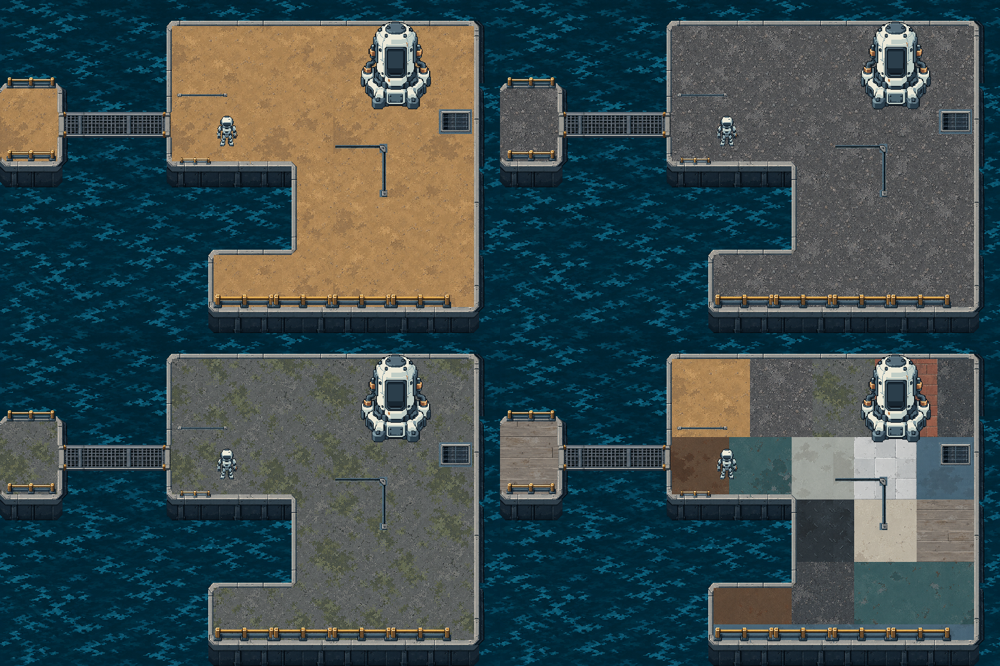

# MyGDShader

一个边学边做的 **Godot Shader 学习工程**。你可以运行独立的着色器实验，也可以游玩《余烬采能站》的 M0 原型，观察 Shader 如何参与角色受击、站点状态和采集反馈。

项目同时维护 Ember 像素素材、可复用 UI、建筑交互示例及美术生产记录。完整商业游戏和后续课程效果仍在开发中；素材示例的完成不等于已经接入主游戏。

## 环境

| 项目 | 配置 |
| --- | --- |
| 引擎 | Godot 4.7；当前工作环境为 **Godot 4.7.2** |
| 渲染器 | Compatibility |
| 语言 | GDScript、Godot Shader Language |
| 主工程视口 | 720 × 720 |
| 默认入口 | `scenes/m0/game_menu.tscn` |

建议使用 Godot 4.7.2 打开工程。主项目不需要额外插件；`tools/` 中的美术生产与打包脚本按需使用，部分脚本需要 Python 或 PowerShell。

## 快速开始

```bash
git clone https://github.com/shirulot/MyGDShader.git
cd MyGDShader
```

1. 在 Godot 项目管理器中导入根目录的 [project.godot](project.godot)。
2. 等待首次资源导入完成。Godot 会自动生成本地 `.godot/` 缓存。
3. 按 **F5** 运行项目，在菜单中点击「游戏开始」。
4. 查看某个独立实验时，打开对应 `.tscn`，按 **F6** 运行当前场景。

如果 Godot 已加入 PATH，也可以从项目根目录启动编辑器：

```bash
godot --editor --path .
```

### M0 原型操作

| 操作 | 按键 / 条件 |
| --- | --- |
| 移动 | WASD 或方向键 |
| 采集能量 | 在站点采集范围内停止移动；站点处于安全或预警阶段 |
| 重新开始 | R |
| 胜利 | 能量达到 380 |
| 失败 | 生命归零，或 120 秒倒计时结束 |

原型包含三处错峰运行的采能站、危险阶段伤害、受击无敌反馈、HUD、结果页和重开。当前主游戏保留早期素材；新像素机器人、地板、建筑和 UI 的演示入口见下方。

## Shader 实验

课程规划包含 **6 个 Phase、16 个 Chapter、48 个 Section**，由独立实验逐步过渡到 2D 游戏应用和小型 3D 可玩项目。

截至 **2026-10-07**，C01～C06 核心学习已完成，C06 水波、局部热浪、像素化和 RGB 色散的四组实验已核对；现已新开 C07，从 Alpha 与邻域采样起步，尚无本章验收作品。学习进度与游戏接入分别登记：已学会某个效果，不代表该效果已经用于 M0。

| 章节 | 内容 | 可打开的场景示例 |
| --- | --- | --- |
| C01 | 纹理采样、颜色、Alpha 与受击染色 | [ch01_01_lab.tscn](scenes/chapter01/ch01_01_lab.tscn) |
| C02 | UV 偏移、中心缩放、旋转 | [ch02_01_uv_offset.tscn](scenes/chapter02/ch02_01_uv_offset.tscn) |
| C03 | TIME 动画、重复图案、软硬边界 | [ch03_03_edges.tscn](scenes/chapter03/ch03_03_edges.tscn) |
| C04 | 纹理 Mask、距离圆形、Mask 组合 | [ch04_03_mask_combine.tscn](scenes/chapter04/ch04_03_mask_combine.tscn) |
| C05 | Noise、溶解与边缘色带 | [ch05_02_noise_dissolve.tscn](scenes/chapter05/ch05_02_noise_dissolve.tscn) |
| C06 | 水波、局部热浪、像素化与 RGB 色散 | [ch06_01_sine_distortion.tscn](scenes/chapter06/ch06_01_sine_distortion.tscn)、[ch06_03_rgb_split.tscn](scenes/chapter06/ch06_03_rgb_split.tscn) |
| C07 · 进行中 | Alpha 邻域描边；随后学习多层假光与强调参数 | [本章交接](docs/shader-learning/chapter07-chat-prompt.md)，实验由新教师逐步准备 |

C07 核心结束后拟插入一次现有站点状态的描边/假发光接入，当前不开游戏 Chat，不扩玩法。C08～C16 的效果、参数驱动、后处理、灯光与 3D 内容仍按课程路线推进。查看 [完整课程](docs/shader-learning/curriculum.md)、[最新进度](docs/shader-learning/progress.md)和[游戏效果应用矩阵](docs/shader-learning/game-effect-coverage.md)。

`shader/main.gdshader` 保留基础练习；章节实验使用各自的 Shader。`shader/demos/` 保存历史实验，`shader/player.gdshader` 和 `shader/energy_station.gdshader` 用于 M0 的角色与站点反馈。

## Ember 素材与示例

美术方向采用低饱和旧工业像素风：蓝灰结构、克制的黄铜细节、清晰的像素面，以及较连续的地面表现。具体素材的验收范围以对应说明和审核记录为准。



*上图是地板资源的 Godot 实拼预览，主游戏当前尚未采用该整套场景。*

| 内容 | 入口 |
| --- | --- |
| 素材导航与版本记录 | [assets/ember/README.md](assets/ember/README.md) |
| 像素机器人与动画 | [robot_animation_sandbox_v003.tscn](scenes/ember/robot_animation_sandbox_v003.tscn) |
| 十三材质地板 v006 | [使用说明](assets/ember/environment/reference_floor_v006/README.md) |
| 最终 UI 资源 | [说明与入口](assets/ember/ui_final/README.md)、[demo.tscn](assets/ember/ui_final/demo.tscn)、[可视化总览](assets/ember/ui_final/index.html) |
| 控制塔、维修工坊、物流仓库 | [建筑资源包](assets/ember/buildings_final/README.md) |
| 其他地图资源 | [map_assets_v001/README.md](assets/ember/map_assets_v001/README.md) |

UI 示例可以在主工程中打开 `demo.tscn` 后按 F6。建筑独立示例需单独导入 `assets/ember/buildings_final/examples/standalone/project.godot` 后按 F5；具体操作见各自说明。

地板使用 **128 纹理像素 / 32 世界单位**的共享网格及 `TileMapLayer.scale = 0.25`。v006 中 Floor 和 Bridge 各有 47 种连接形态，混铺与桥口规则见 [v006 使用说明](assets/ember/environment/reference_floor_v006/README.md)和[材质生产记录](docs/shader-learning/reference-floor-v006-materials.md)。概念图、结构测试和实际场景验收分别保留记录。

## 目录

```text
MyGDShader/
├── project.godot        # Godot 工程与输入、渲染配置
├── game.gd              # M0 全局状态：生命、能量、倒计时、结果与重开
├── scenes/
│   ├── chapter01～06/   # 各章节独立 Shader 实验
│   ├── m0/              # 游戏菜单、采能原型、玩家、站点与结果页
│   └── ember/           # 素材、动画、地板与 UI 示例
├── shader/              # 基础练习与历史 demo
├── scripts/ember/       # 素材示例和组件脚本
├── assets/
│   ├── shader-learning/ # 采样、颜色、Mask 等教学输入
│   ├── ember/           # 像素角色、环境、UI、建筑与技术输入
│   └── vendor/          # 第三方素材及原许可证
├── art-source/ember/    # 美术源稿、提示词、生产参数与审核记录
├── docs/shader-learning/# 课程、进度、策划、资源台账与交接说明
├── tools/               # 美术构建、验证、导出与打包脚本
└── .agents/skills/      # 项目协作与课程统合 skill
```

## 项目文档

- [课程统合入口](docs/shader-learning/README.md)：课程与制作文档导航。
- [学习进度](docs/shader-learning/progress.md)：已完成、进行中和待补验内容。
- [学习目标](docs/shader-learning/requirements.md)与[长期教学偏好](docs/shader-learning/learner-preferences.md)：练习和协作规则。
- [伴随课程小游戏](docs/shader-learning/game-project.md)：M0 玩法与逐章接入路线。
- [商业游戏提案](docs/shader-learning/commercial-game-plan.md)：长期方向，部分内容仍待玩法验证。
- [资源台账](docs/shader-learning/resources.md)：素材来源、用途、版本和许可记录。
- [美术规范](docs/shader-learning/art-style-standard-v002.md)与[技术美术审查规范](docs/shader-learning/ta-art-review-standard-v001.md)：生产和验收标准。

## 版本管理与维护

仓库保留代码、运行资源、课程文档、美术源稿和生产记录。`.gitignore` 排除 Godot 缓存、Python 缓存、运行日志、重复的交付压缩包与临时复验工程；这些文件仍保留在原本的本地目录。

提交场景或脚本时，同时保留相应的 `.uid`、纹理 `.import` 配置及 `.gdignore`。这些文件记录资源标识、导入设置和目录隔离规则；它们与可重新生成的 `.godot/` 缓存用途不同。

历史文档中的 ZIP 链接和临时复验目录可能只在原工作区存在。克隆仓库后优先使用本 README 列出的主工程、正式资源目录及独立示例；需要重建交付包时，先查看对应 `tools/` 脚本和版本说明。

维护时先确认目标属于独立练习、游戏接入还是美术示例，再做最小必要修改。练习效果由学习者实现，协作者负责必要的场景连接、解释和审阅；新增效果应说明用途，并核对显示、判定与重开状态。

## 素材来源与许可

第三方 Kenney RTS Sci-fi 素材保留 [原始 CC0 许可证](assets/vendor/kenney/rts-scifi/License.txt)。Ember 自制及 AI 辅助素材的母稿、提示词和来源记录见 `art-source/ember/` 与[资源台账](docs/shader-learning/resources.md)，它们没有统一登记为 CC0。

当前仓库尚未声明覆盖全部代码和素材的统一开源许可证。引用或再分发前，请按具体文件的来源与许可记录确认使用范围。
