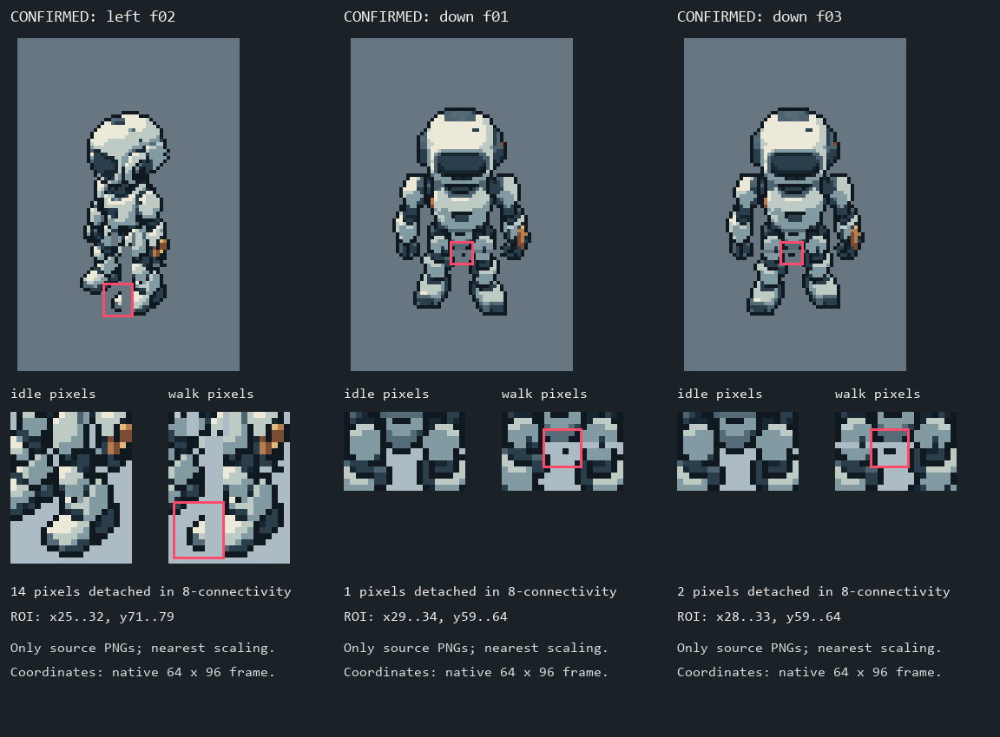

# 素材像素断裂复查

2026-10-04。机器人源图存在 **3 帧确诊悬空碎片**，另有 **5 帧关节接缝需要美术复审**；机器人动画需要修补后重新验收。先前交付的数量、文件一致性和播放检查没有发现这些连接缺陷，不能用旧报告的“通过”覆盖本次发现。

本次是检查和定位，未修改正式 PNG、SpriteFrames、TileSet、项目、旧报告或 ZIP。只在本目录保存审计脚本、数据和诊断图。

## 机器人发现

帧名从 `f00` 开始，坐标为原生 64×96 PNG 的 `(x,y)`；下表范围包含末端像素。

| 帧 | 严格确诊 | 原生位置 |
| --- | --- | --- |
| `robot_walk_left_f02_v001.png`（第3帧） | 14 像素靴边与主体完全分离，8邻接也不连通 | x27～29，y73～78 |
| `robot_walk_down_f01_v001.png`（第2帧） | 髋部1像素悬空 | (32,62) |
| `robot_walk_down_f03_v001.png`（第4帧） | 髋部2像素悬空 | (30,62)、(31,62) |

左向近侧靴的边缘在原始 rig 中误分给另一条腿；两条腿向不同方向平移后，边缘被拉离本体。朝下两帧的部件位移也暴露出髋部连接问题。16 张行走帧用原整理器只读重建后，与生产 PNG 的每个像素相同，缺陷能稳定复现。

`left f00/f01/f03`、`right f02/f03` 还出现与部件硬分区边界重合的透明接缝。这些属于需要复审的关节连接候选：正常摆臂允许肩下负空间，不能把全部孔洞自动填满，也不能把五帧都说成完全断肢。

[逐帧中文说明](robot/robot-review.md)、[精确坐标与来源报告](robot/robot-quality-review.json)、[靴部错误分区证据](robot/left_boot_rig_split_proof_8x.png)、[接缝候选与确诊对比](robot/joint_seams_and_fragments_6_examples_4x.png)。

## 其他素材范围

| 范围 | 实际检查 | 本次结果 |
| --- | --- | --- |
| 机器人 | 20单帧＋1图集；16行走帧及四个循环端点 | 3帧确诊、5帧接缝复审；4待机未发现同类悬空问题 |
| 三套瓦片 | 3图集、62图块，278种物理拼法／556个方向连接 | 未发现结构断裂；端口和内侧两像素保持连续 |
| 其他美术 | 41 PNG：19建筑／物件、15 UI、7 VFX／3D | 未发现同类断裂；全部逐张查看1×与整数最近邻4× |
| 技术输入 | 40 PNG | 133项通道／几何复核通过；设备Mask Alpha与底图一致，Noise边界吻合，粒子8连通 |

合计覆盖当前 **105 张生产 PNG**（21机器人＋3瓦片＋41其他美术＋40技术输入）。锈点、螺栓、碎屑、泡沫溅沫、门洞、管路空隙、草叶斜向阶梯以及 Alpha 测试孔洞按用途判断，不算作缺失像素。

[瓦片独立报告](tiles/README.md)、[其他美术独立报告](other-art/README.md)、[技术输入复核](technical-report.json)。静态素材“未发现同类断裂”是本次范围内的审阅结论。

## 引擎对照与修补依据

当前105 PNG的 Godot 导入可见 RGB／Alpha 与源图一致。实际通过 SpriteFrames 的 AtlasTexture 对机器人20帧做1倍和2倍 Nearest GPU渲染，共40例，颜色及轮廓差异均为0。现有示例设置忠实显示了源图中已经存在的缺陷。

[实际引擎报告](engine/import-render-report.json)和40张GPU输出保存在 `engine/`。新检查器不写资源、不重建场景、不修改项目设置；[源代码](check_import_and_render.gd)可审阅。

修补时应先更正靴部像素的 rig 归属，再处理髋部连接，逐帧审阅五帧接缝，保持正常腋下／双腿负空间。用新版本重建单帧、图集和 SpriteFrames，重新验证全部20帧和四个循环端点；保留当前版本及旧交付快照。不能只删除悬空像素或对整图统一膨胀填孔。
