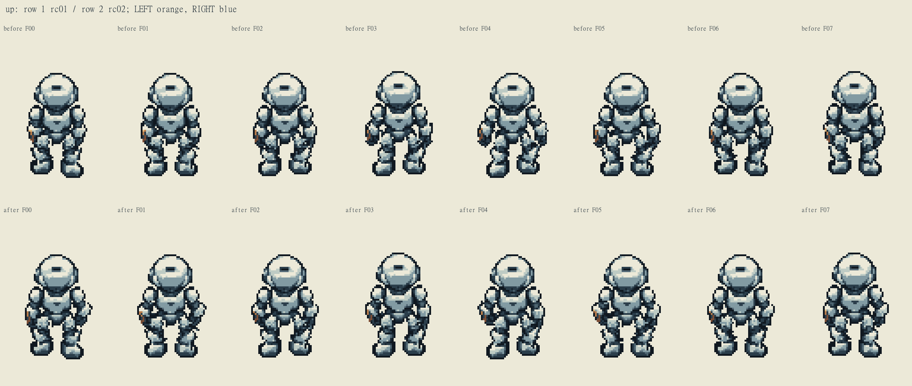
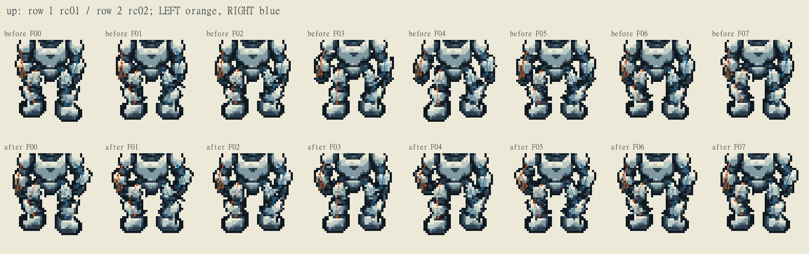
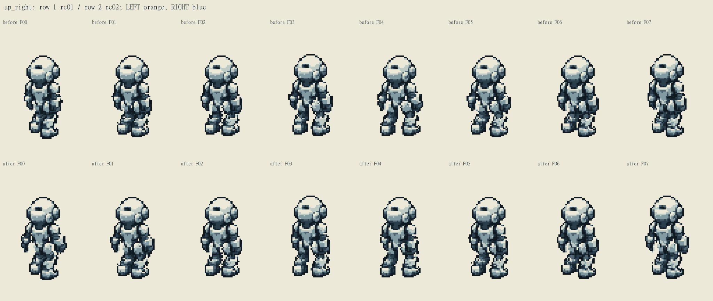
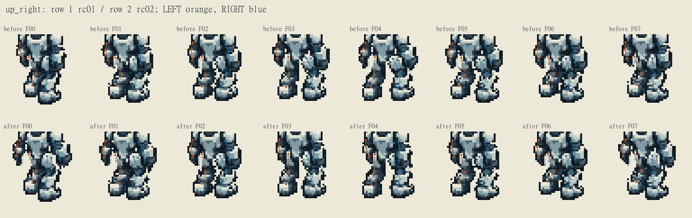
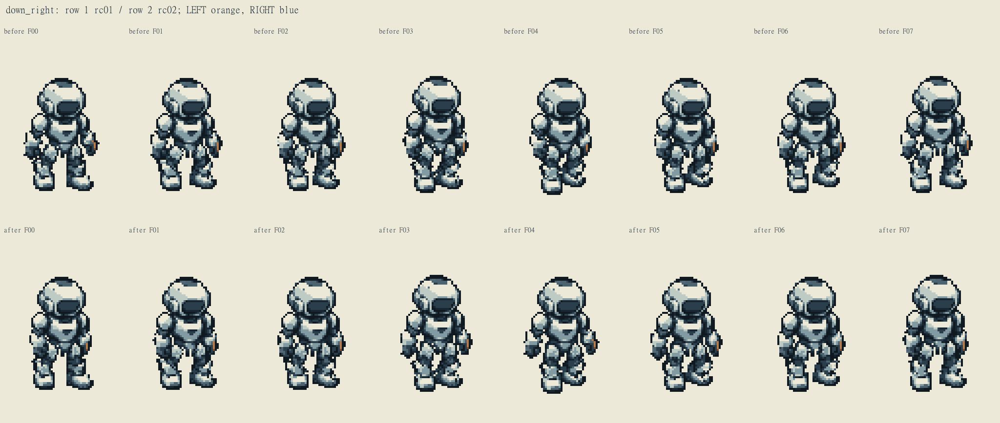
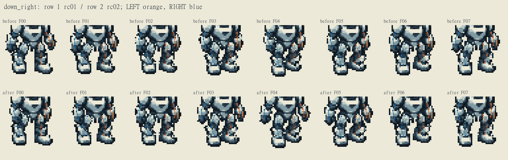

# B1 rc02 摆臂返修证据

本表绑定实际最终 PNG、rc01 对照、源片和八帧骨点。LEFT/RIGHT 均为角色自己的左右；所有坐标使用同一64×96画布。S/SW/NW共24行走帧与8身份图原字节保持。

东北、东南：按右向投影反转摆臂角。朝北：手腕采用与同侧脚前后运动相反的纵向目标，定长双骨求肘位。身体、腿和靴变换均未改动。东北另将母图(22,59)一枚原色腕部像素从身体归入左前臂，静态实拼仍零差。

足踝坐标同时包含地面方向投影与抬脚高度；不能把抬脚造成的屏幕Y变化直接当成步相。F00/F04均为相同body bob和零抬脚的接触相，适合核对交错关系。F07/F00用于观察回环，不要求骨点相同。技术数值不代替正常速度与慢速视觉复审。

## up

橙色为解剖左侧，蓝色为解剖右侧；实线连肩—肘—腕，虚线连髋—膝—踝。骨点示意没有用于修改任何素材。

left F00→F04：腕沿朝向投影 0.068 → 0.480；踝 -0.480 px；修后异号。

right F00→F04：腕沿朝向投影 0.266 → -0.480；踝 0.480 px；修后异号。

| 帧/侧 | 地面步相 / 抬脚 | 修后肩 → 肘 → 腕 | 修后髋 → 膝 → 踝 |
|---|---|---|---|
| F00 left | 1.0 / 0.0 px | (18.00, 47.70) → (16.76, 52.65) → (18.00, 58.60) | (25.00, 56.70) → (21.27, 64.95) → (24.00, 71.40) |
| F00 right | -1.0 / 0.0 px | (44.00, 47.70) → (47.45, 51.83) → (45.00, 57.40) | (38.00, 56.70) → (39.61, 65.56) → (39.00, 72.60) |
| F01 left | 0.6 / 0.0 px | (18.00, 48.00) → (15.91, 52.65) → (18.00, 58.36) | (25.00, 57.00) → (21.21, 65.22) → (24.00, 71.64) |
| F01 right | -0.6 / 0.5 px | (44.00, 48.00) → (47.50, 52.09) → (45.00, 57.64) | (38.00, 57.00) → (41.56, 65.27) → (39.00, 71.86) |
| F02 left | 0.0 / 0.0 px | (18.00, 47.60) → (15.96, 52.27) → (18.00, 58.00) | (25.00, 56.60) → (22.24, 65.22) → (24.00, 72.00) |
| F02 right | 0.0 / 1.1 px | (44.00, 47.60) → (46.81, 52.19) → (45.00, 58.00) | (38.00, 56.60) → (42.17, 64.58) → (39.00, 70.90) |
| F03 left | -0.6 / 0.0 px | (18.00, 47.40) → (15.76, 51.98) → (18.00, 57.64) | (25.00, 56.40) → (23.73, 65.37) → (24.00, 72.36) |
| F03 right | 0.6 / 0.7 px | (44.00, 47.40) → (46.07, 52.37) → (45.00, 58.36) | (38.00, 56.40) → (41.92, 64.50) → (39.00, 70.94) |
| F04 left | -1.0 / 0.0 px | (18.00, 47.70) → (15.23, 51.98) → (18.00, 57.40) | (25.00, 56.70) → (23.45, 65.62) → (24.00, 72.60) |
| F04 right | 1.0 / 0.0 px | (44.00, 47.70) → (46.17, 52.63) → (45.00, 58.60) | (38.00, 56.70) → (41.75, 64.88) → (39.00, 71.40) |
| F05 left | -0.6 / 0.5 px | (18.00, 48.00) → (15.18, 52.25) → (18.00, 57.64) | (25.00, 57.00) → (21.46, 65.34) → (24.00, 71.86) |
| F05 right | 0.6 / 0.0 px | (44.00, 48.00) → (46.85, 52.57) → (45.00, 58.36) | (38.00, 57.00) → (41.81, 65.15) → (39.00, 71.64) |
| F06 left | 0.0 / 1.1 px | (18.00, 47.60) → (15.96, 52.27) → (18.00, 58.00) | (25.00, 56.60) → (20.85, 64.65) → (24.00, 70.90) |
| F06 right | 0.0 / 0.0 px | (44.00, 47.60) → (46.81, 52.19) → (45.00, 58.00) | (38.00, 56.60) → (40.79, 65.16) → (39.00, 72.00) |
| F07 left | 0.6 / 0.7 px | (18.00, 47.40) → (16.90, 52.38) → (18.00, 58.36) | (25.00, 56.40) → (21.10, 64.57) → (24.00, 70.94) |
| F07 right | -0.6 / 0.0 px | (44.00, 47.40) → (46.98, 51.89) → (45.00, 57.64) | (38.00, 56.40) → (39.35, 65.30) → (39.00, 72.36) |

修前、修后的全部骨点与像素差记录见 `arm_phase_revision_evidence.json`；掩膜外实际 RGBA 差为0。

## up_right

橙色为解剖左侧，蓝色为解剖右侧；实线连肩—肘—腕，虚线连髋—膝—踝。骨点示意没有用于修改任何素材。

left F00→F04：腕沿朝向投影 -3.539 → 3.539；踝 -4.347 px；修后异号。

right F00→F04：腕沿朝向投影 4.257 → -4.257；踝 4.347 px；修后异号。

| 帧/侧 | 地面步相 / 抬脚 | 修后肩 → 肘 → 腕 | 修后髋 → 膝 → 踝 |
|---|---|---|---|
| F00 left | 1.0 / 0.0 px | (19.00, 46.70) → (17.04, 50.33) → (17.22, 55.42) | (24.00, 54.70) → (28.11, 63.82) → (26.00, 70.49) |
| F00 right | -1.0 / 0.0 px | (37.00, 47.70) → (39.93, 51.08) → (40.90, 57.00) | (34.00, 55.70) → (34.84, 64.66) → (33.00, 72.51) |
| F01 left | 0.6 / 0.0 px | (19.00, 47.00) → (17.41, 50.81) → (17.92, 55.88) | (24.00, 55.00) → (27.87, 64.22) → (25.20, 70.69) |
| F01 right | -0.6 / 0.5 px | (37.00, 48.00) → (39.58, 51.66) → (40.16, 57.63) | (34.00, 56.00) → (37.10, 64.45) → (33.80, 71.81) |
| F02 left | 0.0 / 0.0 px | (19.00, 46.60) → (18.00, 50.60) → (19.00, 55.60) | (24.00, 54.60) → (26.20, 64.35) → (24.00, 71.00) |
| F02 right | 0.0 / 1.1 px | (37.00, 47.60) → (39.00, 51.60) → (39.00, 57.60) | (34.00, 55.60) → (38.26, 63.53) → (35.00, 70.90) |
| F03 left | -0.6 / 0.0 px | (19.00, 46.40) → (18.61, 50.50) → (20.09, 55.38) | (24.00, 54.40) → (23.94, 64.40) → (22.80, 71.31) |
| F03 right | 0.6 / 0.7 px | (37.00, 47.40) → (38.38, 51.65) → (37.80, 57.63) | (34.00, 55.40) → (38.42, 63.24) → (36.20, 70.99) |
| F04 left | -1.0 / 0.0 px | (19.00, 46.70) → (19.02, 50.82) → (20.82, 55.60) | (24.00, 54.70) → (23.58, 64.69) → (22.00, 71.51) |
| F04 right | 1.0 / 0.0 px | (37.00, 47.70) → (37.95, 52.07) → (36.98, 57.99) | (34.00, 55.70) → (38.40, 63.55) → (37.00, 71.49) |
| F05 left | -0.6 / 0.5 px | (19.00, 47.00) → (18.61, 51.10) → (20.09, 55.98) | (24.00, 55.00) → (26.29, 64.74) → (22.80, 70.81) |
| F05 right | 0.6 / 0.0 px | (37.00, 48.00) → (38.38, 52.25) → (37.80, 58.23) | (34.00, 56.00) → (38.30, 63.91) → (36.20, 71.69) |
| F06 left | 0.0 / 1.1 px | (19.00, 46.60) → (18.00, 50.60) → (19.00, 55.60) | (24.00, 54.60) → (27.63, 63.92) → (24.00, 69.90) |
| F06 right | 0.0 / 0.0 px | (37.00, 47.60) → (39.00, 51.60) → (39.00, 57.60) | (34.00, 55.60) → (36.82, 64.15) → (35.00, 72.00) |
| F07 left | 0.6 / 0.7 px | (19.00, 46.40) → (17.41, 50.21) → (17.92, 55.28) | (24.00, 54.40) → (27.98, 63.57) → (25.20, 69.99) |
| F07 right | -0.6 / 0.0 px | (37.00, 47.40) → (39.58, 51.06) → (40.16, 57.03) | (34.00, 55.40) → (35.04, 64.34) → (33.80, 72.31) |

修前、修后的全部骨点与像素差记录见 `arm_phase_revision_evidence.json`；掩膜外实际 RGBA 差为0。

## down_right

橙色为解剖左侧，蓝色为解剖右侧；实线连肩—肘—腕，虚线连髋—膝—踝。骨点示意没有用于修改任何素材。

left F00→F04：腕沿朝向投影 -3.752 → 3.752；踝 -4.347 px；修后异号。

right F00→F04：腕沿朝向投影 4.642 → -4.642；踝 4.347 px；修后异号。

| 帧/侧 | 地面步相 / 抬脚 | 修后肩 → 肘 → 腕 | 修后髋 → 膝 → 踝 |
|---|---|---|---|
| F00 left | 1.0 / 0.0 px | (43.00, 47.70) → (42.98, 51.82) → (42.01, 57.74) | (37.00, 56.70) → (38.83, 65.51) → (39.00, 71.51) |
| F00 right | -1.0 / 0.0 px | (19.00, 47.70) → (18.30, 53.04) → (20.26, 58.80) | (26.00, 56.70) → (21.62, 64.63) → (23.00, 71.49) |
| F01 left | 0.6 / 0.0 px | (43.00, 48.00) → (43.39, 52.10) → (42.81, 58.08) | (37.00, 57.00) → (39.85, 65.54) → (38.20, 71.31) |
| F01 right | -0.6 / 0.5 px | (19.00, 48.00) → (17.77, 53.24) → (19.35, 59.12) | (26.00, 57.00) → (21.22, 64.69) → (23.80, 71.19) |
| F02 left | 0.0 / 0.0 px | (43.00, 47.60) → (44.00, 51.60) → (44.00, 57.60) | (37.00, 56.60) → (39.05, 65.36) → (37.00, 71.00) |
| F02 right | 0.0 / 1.1 px | (19.00, 47.60) → (17.00, 52.60) → (18.00, 58.60) | (26.00, 56.60) → (21.85, 64.65) → (25.00, 70.90) |
| F03 left | -0.6 / 0.0 px | (43.00, 47.40) → (44.59, 51.21) → (45.17, 57.18) | (37.00, 56.40) → (38.41, 65.29) → (35.80, 70.69) |
| F03 right | 0.6 / 0.7 px | (19.00, 47.40) → (16.28, 52.04) → (16.69, 58.11) | (26.00, 56.40) → (23.56, 65.12) → (26.20, 71.61) |
| F04 left | -1.0 / 0.0 px | (43.00, 47.70) → (44.96, 51.33) → (45.93, 57.25) | (37.00, 56.70) → (38.45, 65.58) → (35.00, 70.49) |
| F04 right | 1.0 / 0.0 px | (19.00, 47.70) → (15.83, 52.05) → (15.84, 58.13) | (26.00, 56.70) → (25.27, 65.73) → (27.00, 72.51) |
| F05 left | -0.6 / 0.5 px | (43.00, 48.00) → (44.59, 51.81) → (45.17, 57.78) | (37.00, 57.00) → (39.66, 65.60) → (35.80, 70.19) |
| F05 right | 0.6 / 0.0 px | (19.00, 48.00) → (16.28, 52.64) → (16.69, 58.71) | (26.00, 57.00) → (23.71, 65.76) → (26.20, 72.31) |
| F06 left | 0.0 / 1.1 px | (43.00, 47.60) → (44.00, 51.60) → (44.00, 57.60) | (37.00, 56.60) → (40.38, 64.94) → (37.00, 69.90) |
| F06 right | 0.0 / 0.0 px | (19.00, 47.60) → (17.00, 52.60) → (18.00, 58.60) | (26.00, 56.60) → (23.24, 65.22) → (25.00, 72.00) |
| F07 left | 0.6 / 0.7 px | (43.00, 47.40) → (43.39, 51.50) → (42.81, 57.48) | (37.00, 56.40) → (40.00, 64.88) → (38.20, 70.61) |
| F07 right | -0.6 / 0.0 px | (19.00, 47.40) → (17.77, 52.64) → (19.35, 58.52) | (26.00, 56.40) → (22.61, 64.80) → (23.80, 71.69) |

修前、修后的全部骨点与像素差记录见 `arm_phase_revision_evidence.json`；掩膜外实际 RGBA 差为0。

