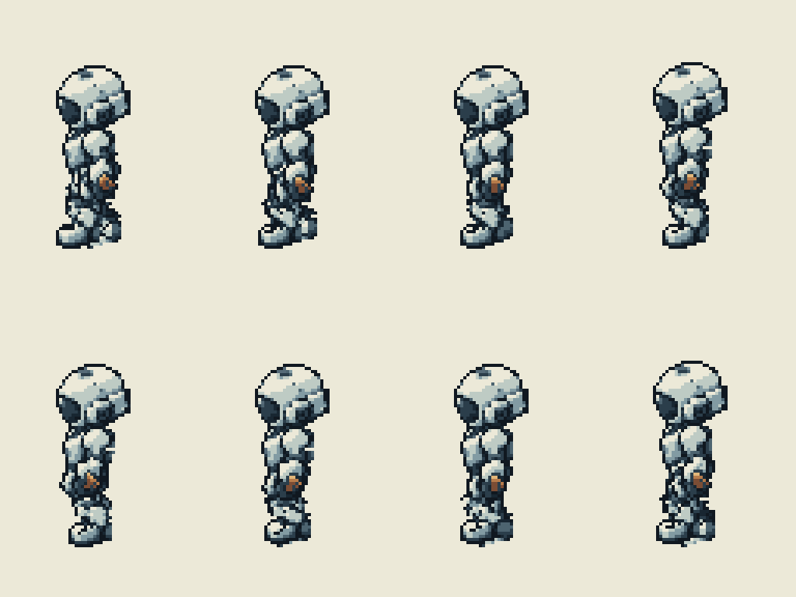
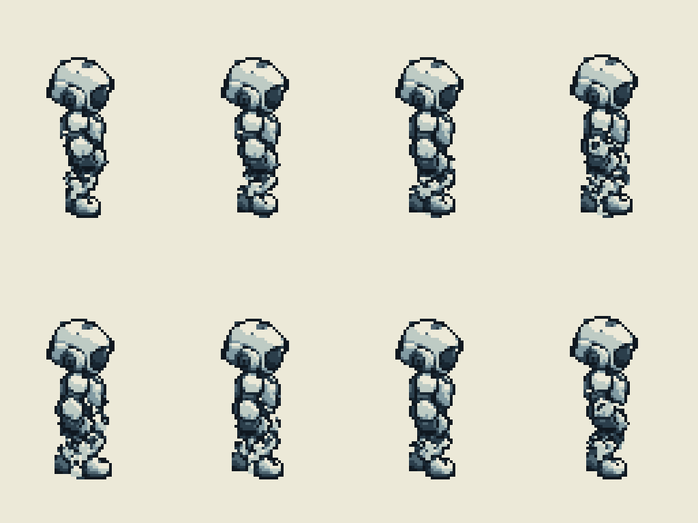

# W/E 行走固定来源与步相

新增W/E各8帧，64×96、root(32,80)、8FPS循环。B1 rc02的48行走帧与8身份图原字节保持。W/E不是镜像。完整隐藏肢体来自一次imagegen，分别一次裁切登记到母版坐标；登记尺寸不按动画帧变化。原母版可见像素覆盖隐藏源，静态实拼零差。随后每方向11个固定片排姿，局部imagegen只修连接。

## left

解剖左前臂黄铜色像素13，右前臂0；右向工具由远侧左臂遮挡，不能加到近侧右臂。身体分区y55以下无残留手/腿像素。

left：F00→F04腕/踝沿朝向投影 5.234 / -4.000，异号。

right：F00→F04腕/踝沿朝向投影 -5.234 / 4.000，异号。

| 帧/解剖侧 | 肩 → 肘 → 腕 | 髋 → 膝 → 踝 | 抬脚px |
|---|---|---|---|
| F00 left | (31.00,47.70) → (32.48,53.51) → (30.66,60.91) | (29.00,55.70) → (25.67,65.13) → (27.00,72.00) | 0 |
| F00 right | (27.00,45.70) → (24.55,51.27) → (23.41,58.17) | (32.00,55.70) → (31.14,65.16) → (34.00,71.00) | 0 |
| F01 left | (31.00,48.00) → (31.90,53.93) → (29.59,61.19) | (29.00,56.00) → (25.53,65.38) → (27.80,72.00) | 0 |
| F01 right | (27.00,46.00) → (25.11,51.78) → (24.43,58.75) | (32.00,56.00) → (29.49,65.16) → (33.20,70.50) | 0.5 |
| F02 left | (31.00,47.60) → (31.00,53.60) → (28.00,60.60) | (29.00,55.60) → (26.80,65.35) → (29.00,72.00) | 0 |
| F02 right | (27.00,45.60) → (26.00,51.60) → (26.00,58.60) | (32.00,55.60) → (28.49,64.43) → (32.00,69.90) | 1.1 |
| F03 left | (31.00,47.40) → (30.10,53.33) → (26.44,60.01) | (29.00,55.40) → (28.01,65.35) → (30.20,72.00) | 0 |
| F03 right | (27.00,45.40) → (26.91,51.48) → (27.59,58.45) | (32.00,55.40) → (28.49,64.23) → (30.80,70.30) | 0.7 |
| F04 left | (31.00,47.70) → (29.52,53.51) → (25.42,59.94) | (29.00,55.70) → (28.05,65.65) → (31.00,72.00) | 0 |
| F04 right | (27.00,45.70) → (27.52,51.76) → (28.65,58.67) | (32.00,55.70) → (28.74,64.62) → (30.00,71.00) | 0 |
| F05 left | (31.00,48.00) → (30.10,53.93) → (26.44,60.61) | (29.00,56.00) → (26.36,65.65) → (30.20,71.50) | 0.5 |
| F05 right | (27.00,46.00) → (26.91,52.08) → (27.59,59.05) | (32.00,56.00) → (28.62,64.88) → (30.80,71.00) | 0 |
| F06 left | (31.00,47.60) → (31.00,53.60) → (28.00,60.60) | (29.00,55.60) → (25.37,64.92) → (29.00,70.90) | 1.1 |
| F06 right | (27.00,45.60) → (26.00,51.60) → (26.00,58.60) | (32.00,55.60) → (29.87,64.86) → (32.00,71.00) | 0 |
| F07 left | (31.00,47.40) → (31.90,53.33) → (29.59,60.59) | (29.00,55.40) → (25.39,64.73) → (27.80,71.30) | 0.7 |
| F07 right | (27.00,45.40) → (25.11,51.18) → (24.43,58.15) | (32.00,55.40) → (31.08,64.86) → (33.20,71.00) | 0 |
## right

解剖左前臂黄铜色像素3，右前臂0；右向工具由远侧左臂遮挡，不能加到近侧右臂。身体分区y55以下无残留手/腿像素。

left：F00→F04腕/踝沿朝向投影 5.234 / -4.000，异号。

right：F00→F04腕/踝沿朝向投影 -5.234 / 4.000，异号。

| 帧/解剖侧 | 肩 → 肘 → 腕 | 髋 → 膝 → 踝 | 抬脚px |
|---|---|---|---|
| F00 left | (34.00,45.70) → (33.48,51.76) → (32.35,58.67) | (28.00,55.70) → (31.26,64.62) → (30.00,71.00) | 0 |
| F00 right | (28.00,47.70) → (29.48,53.51) → (33.58,59.94) | (31.00,55.70) → (31.95,65.65) → (29.00,72.00) | 0 |
| F01 left | (34.00,46.00) → (34.09,52.08) → (33.41,59.05) | (28.00,56.00) → (31.38,64.88) → (29.20,71.00) | 0 |
| F01 right | (28.00,48.00) → (28.90,53.93) → (32.56,60.61) | (31.00,56.00) → (33.64,65.65) → (29.80,71.50) | 0.5 |
| F02 left | (34.00,45.60) → (35.00,51.60) → (35.00,58.60) | (28.00,55.60) → (30.13,64.86) → (28.00,71.00) | 0 |
| F02 right | (28.00,47.60) → (28.00,53.60) → (31.00,60.60) | (31.00,55.60) → (34.63,64.92) → (31.00,70.90) | 1.1 |
| F03 left | (34.00,45.40) → (35.89,51.18) → (36.57,58.15) | (28.00,55.40) → (28.92,64.86) → (26.80,71.00) | 0 |
| F03 right | (28.00,47.40) → (27.10,53.33) → (29.41,60.59) | (31.00,55.40) → (34.61,64.73) → (32.20,71.30) | 0.7 |
| F04 left | (34.00,45.70) → (36.45,51.27) → (37.59,58.17) | (28.00,55.70) → (28.86,65.16) → (26.00,71.00) | 0 |
| F04 right | (28.00,47.70) → (26.52,53.51) → (28.34,60.91) | (31.00,55.70) → (34.33,65.13) → (33.00,72.00) | 0 |
| F05 left | (34.00,46.00) → (35.89,51.78) → (36.57,58.75) | (28.00,56.00) → (30.51,65.16) → (26.80,70.50) | 0.5 |
| F05 right | (28.00,48.00) → (27.10,53.93) → (29.41,61.19) | (31.00,56.00) → (34.47,65.38) → (32.20,72.00) | 0 |
| F06 left | (34.00,45.60) → (35.00,51.60) → (35.00,58.60) | (28.00,55.60) → (31.51,64.43) → (28.00,69.90) | 1.1 |
| F06 right | (28.00,47.60) → (28.00,53.60) → (31.00,60.60) | (31.00,55.60) → (33.20,65.35) → (31.00,72.00) | 0 |
| F07 left | (34.00,45.40) → (34.09,51.48) → (33.41,58.45) | (28.00,55.40) → (31.51,64.23) → (29.20,70.30) | 0.7 |
| F07 right | (28.00,47.40) → (28.90,53.33) → (32.56,60.01) | (31.00,55.40) → (31.99,65.35) → (29.80,72.00) | 0 |
