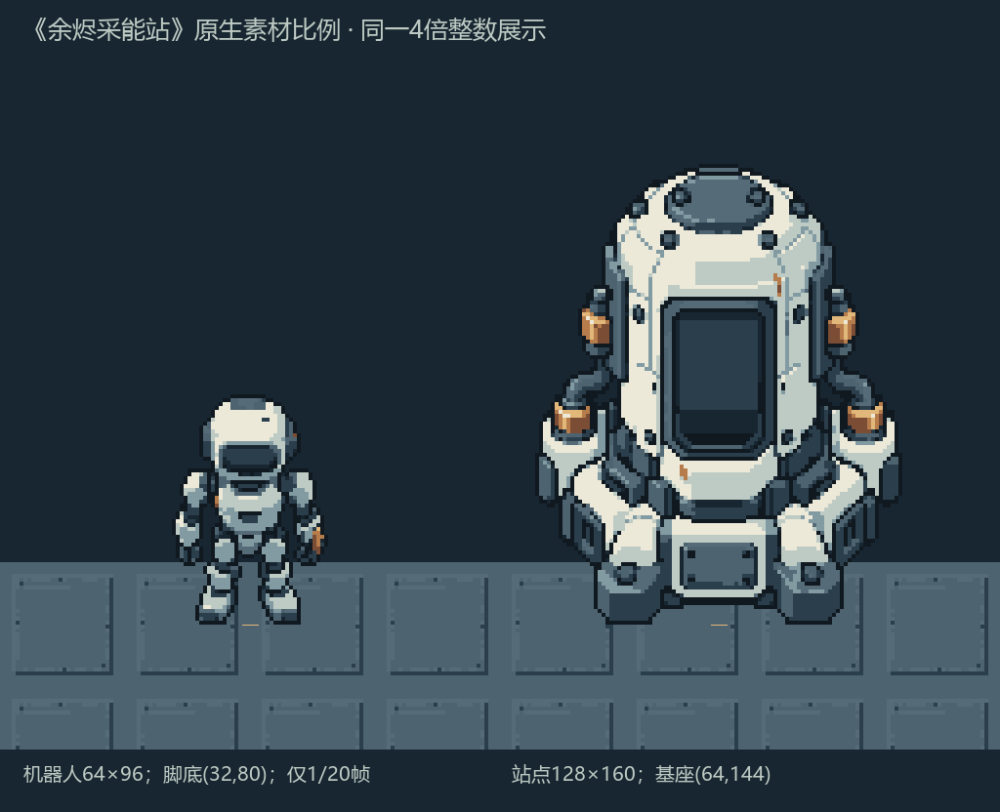
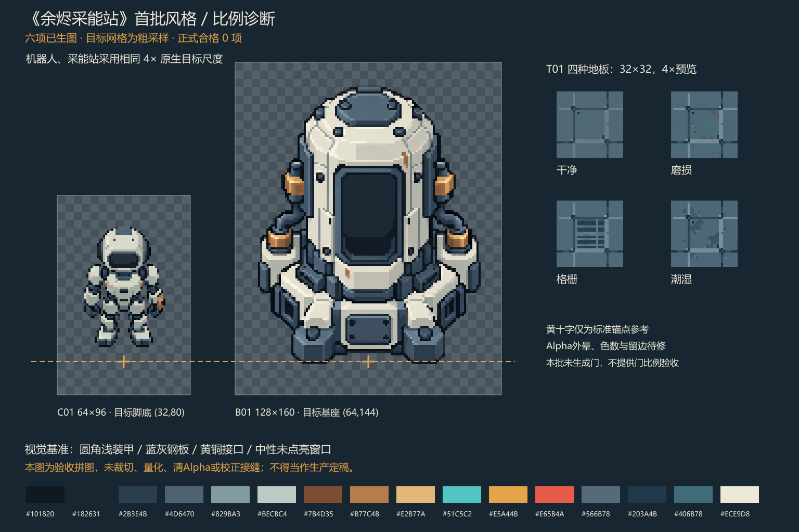

# 《余烬采能站》首批素材生产与验收报告

最新全套进度与新素材复用方法见[完整艺术交付说明](asset-production-full-art.md)。下文保留本批次范围。

当前后续进度为 **123/123，剩余艺术项 0**；C01 四向 **20/20 帧已完成**，详见[机器人动画报告](asset-production-batch-02-robot.md)。下文保存首批完成时的范围与计数；原朝下待机、采能站和四地板未改动。

## 首批交付快照：2026-10-04 原生像素整理完成

原首批 **6/6 艺术单元已完成**：机器人朝下待机一帧、采能站与四种地板。加上本轮已交付的三套通用瓦片集，总体为 **64/123 个正式艺术单元，剩余 59 个未完成**。四地板包含在瓦片集 62 内，不重复计数；C01 只完成 **1/20 帧**，其余 19 帧没有制作。

2026-10-04 按用户“继续”后的脚本整理方案，完成原生网格、登记调色板、二值 Alpha、中性窗口与脚底／基座边界对齐。原始母稿保持原样；这两张对象 PNG 是已有母稿的新派生，**没有新增 imagegen 调用**。

| 项目 | 正式文件 | 实际尺寸 / bbox `[左,上,右,下)` | 透明 / 半透明 / 不透明 | 可见色 / 板外色 | 固定锚点 |
| --- | --- | --- | --- | --- | --- |
| C01 朝下待机 | [robot_idle_down_v001.png](../../assets/ember/characters/robot/robot_idle_down_v001.png) | 64×96 / [12,21,52,80)，主体 40×59 | 4652 / 0 / 1492 | 11 / 0 | (32,80) |
| B01 采能站 | [station_base_v001.png](../../assets/ember/buildings/station/station_base_v001.png) | 128×160 / [17,26,111,144)，主体 94×118 | 12444 / 0 / 8036 | 11 / 0 | (64,144) |
| T01 四地板 | [ground_details_v001.png](../../assets/ember/environment/tilesets/ground_details_v001.png) 内四块 | 每块 32×32 / [0,0,32,32) | 每块 0 / 0 / 1024 | 标准色内 | 网格坐标 |

锚点使用底边界约定：最后可见一行分别为 y=79 / y=143。机器人留边 12/21/12/16；站点留边 17/26/17/16，均满足本项要求。中性窗口不包含青色能量、橙色预警、红色危险状态；机器人与站点原生、整数预览及同地板比例图已由制作代理审查，独立验收代理复核两张 PNG 数值并查看 2 倍与比例图。

2026-10-04 复核补齐[对象窗口与分层记录](../../art-source/ember/batch-01/pixel-finish-v001/object-layout-v001.json)。机器人胸部窗口为 `[30,52,34,54)`，中心 `(32,53)`；采能站含框视觉范围为 `[49,60,79,102)`，窗口安全变化内区为 `[54,66,74,95)`，采用该内区中心 `(64,80.5)`、UV `(0.5,0.503125)` 作为局部能量效果定位。内区是实际连续暗面及整理处理区，完整窗口有倒角，尚未交付精确窗口 Mask。两项均为单张 RGBA 静态 base，发射点为空，无烘焙发光；组件、可动部件及前景层未拆成独立 PNG。对象不平铺；机器人只登记朝下待机第 0 帧，静帧预览帧率不适用。记录绑定实际 PNG 哈希，图片本身未因补记录改写。

整理与测量源见 [finishing-record.json](../../art-source/ember/batch-01/pixel-finish-v001/finishing-record.json)、[measurements.json](../../art-source/ember/batch-01/pixel-finish-v001/measurements.json)、[独立对象验收](../../art-source/ember/batch-01/pixel-finish-v001/validation-objects-independent.json)及[可复现脚本](../../art-source/ember/batch-01/pixel-finish-v001/tools/finish_objects.py)。四地板的接缝、平铺和实际 Godot 资源结果见[瓦片集交付报告](tilemap-reusable-tilesets.md)。

新 [batch01_native_scale_v002.png](../../art-source/ember/references/batch01_native_scale_v002.png)为 1024×832，同一 4 倍整数尺度展示原生机器人、站点与四地板。R01 **仅部分原生比例验证**：未含门或控制台，不登记完整风格／比例参考完成，也不增加艺术单元。

## 2026-10-03 母稿与诊断阶段历史

以下保留当日原始生成、0/123 正式计数、工具限制与待修项，供来源追踪；这些历史状态不覆盖首批正式结果与后续机器人动画交付。

日期：2026-10-03（Asia/Irkutsk）。本批已实际生成 **6/123 个艺术单元的候选母稿，正式合格为 0/123**。内置图片工具共调用 7 次。七份母稿中，一份是机器人 Alpha 修正尝试，不增加艺术单元数。首批候选可用于审查共同造型与配色，仍需像素整理后才能进入游戏。

依据：[全新美术与生图标准 v1.0](art-generation-standard.md)、[生产清单](asset-generation-manifest.csv)。本报告是生产与验收记录，供后续素材制作审阅；本轮没有删除旧资源、修改场景、游戏逻辑或学习者 Shader，也没有进入章节教学。

## 本批范围与计数

| 清单 ID | 本批内容 | 已生成候选 | 正式合格 | 当前状态 |
| --- | --- | ---: | ---: | --- |
| C01 | 机器人朝下待机 1 帧 | 1/20 帧 | 0/20 帧 | `MASTER_GENERATED_1_OF_20_NEEDS_PIXEL_FINISH` |
| B01 | 采能站静态底图 | 1/1 个 | 0/1 个 | `MASTER_GENERATED_NEEDS_PIXEL_FINISH` |
| T01 | 干净、磨损、格栅、潮湿地板各 1 块 | 4/4 块 | 0/4 块 | `MASTERS_GENERATED_4_OF_4_NEEDS_PIXEL_FINISH` |
| R01 | 比例与风格诊断图 | 1 张参考图 | 待审查 | `DIAGNOSTIC_BOARD_CREATED_NEEDS_REVIEW` |

C01 其余 19 帧尚未生成。R01 是非入库参考，不计入 123 个艺术单元；本批未制作门素材，比例图只能检查机器人、采能站与地块，不能替代后续人物、门、控制台的完整比例验收。没有批量生成其余预算，也没有增加可选采集动画。

正式路径预留为 `assets/ember/characters/robot/`、`assets/ember/buildings/station/` 和 `assets/ember/environment/tiles/floor/`。目前正式目录只有[状态说明](../../assets/ember/README.md)，没有生产 PNG。

## 工具、提示词与新参考

使用工具：内置 `image_gen.imagegen`。完整工具输出、源路径、日期、参考关系、调整记录见[生成记录](../../art-source/ember/batch-01/generation-record.json)。原始母稿按字节原样归档，没有把旧素材用于本批参考。

共同视觉从机器人 v001 开始：圆角浅装甲、深蓝灰关节、少量黄铜接口；采能站引用机器人 v001，以方形低基座为目标（实际角脚形态仍待修），沿用圆筒、管线与中性窗口的同一制造体系。干净地板引用机器人与站点；另外三种地板沿用干净地板和站点的新参考。机器人 v002 用于尝试清理 Alpha，未选为本批基准。

| 调用 | 内容 | 完整提示词 | 引用的新版本 |
| --- | --- | --- | --- |
| 1 | 机器人 v001 | [01_robot_idle_down_v001.txt](../../art-source/ember/batch-01/prompts/01_robot_idle_down_v001.txt) | 无外部参考 |
| 2 | 机器人 Alpha 修正 v002 | [02_robot_alpha_cleanup_v002.txt](../../art-source/ember/batch-01/prompts/02_robot_alpha_cleanup_v002.txt) | 机器人 v001 |
| 3 | 采能站 v001 | [03_station_base_v001.txt](../../art-source/ember/batch-01/prompts/03_station_base_v001.txt) | 机器人 v001 |
| 4 | 干净地板 v001 | [04_floor_clean_v001.txt](../../art-source/ember/batch-01/prompts/04_floor_clean_v001.txt) | 机器人 v001、站点 v001 |
| 5 | 磨损地板 v001 | [05_floor_worn_v001.txt](../../art-source/ember/batch-01/prompts/05_floor_worn_v001.txt) | 干净地板 v001、站点 v001 |
| 6 | 格栅地板 v001 | [06_floor_grate_v001.txt](../../art-source/ember/batch-01/prompts/06_floor_grate_v001.txt) | 干净地板 v001、站点 v001 |
| 7 | 潮湿地板 v001 | [07_floor_wet_v001.txt](../../art-source/ember/batch-01/prompts/07_floor_wet_v001.txt) | 干净地板 v001、站点 v001 |

来源标记为 `AI_GENERATED_IN_PROJECT`，不登记为 CC0；来源台账见 [resources.md](resources.md#新美术来源台账首批候选)。本轮人工像素调整为 **无**。模型生成的 Alpha 修正仍有光晕与半透明，原稿及修正稿均保留，以便追踪限制。

## 母稿实测

以下数据由[只读 PNG 验收脚本](../../art-source/ember/batch-01/tools/validate_assets.py)测量。包围盒采用 `[左, 上, 右, 下)`，右、下边界不包含在主体中；可见颜色统计只计 Alpha 大于 0 的 RGB，板外色指不在标准 16 色中的不同 RGB 数量。

| 母稿 | 实际尺寸 | 透明像素 | 半透明像素 | 不透明像素 | 有效包围盒 | 可见 RGB 色数 | 板外色数 |
| --- | --- | ---: | ---: | ---: | --- | ---: | ---: |
| 机器人 v001 | 1024×1536 | 1,172,229 | 400,635 | 0 | [65,36,978,1514) | 28,195 | 28,191 |
| 机器人 v002，备用修正稿 | 1024×1536 | 1,092,399 | 480,465 | 0 | [65,37,1010,1462) | 32,252 | 32,249 |
| 采能站 v001 | 1122×1402 | 747,970 | 823,257 | 1,817 | [49,53,1108,1402) | 40,053 | 40,047 |
| 干净地板 v001 | 1254×1254 | 0 | 0 | 1,572,516 | [0,0,1254,1254) | 2,715 | 2,712 |
| 磨损地板 v001 | 1254×1254 | 0 | 0 | 1,572,516 | [0,0,1254,1254) | 8,777 | 8,774 |
| 格栅地板 v001 | 1254×1254 | 0 | 0 | 1,572,516 | [0,0,1254,1254) | 3,868 | 3,868 |
| 潮湿地板 v001 | 1254×1254 | 0 | 0 | 1,572,516 | [0,0,1254,1254) | 6,575 | 6,571 |

六张 v001 的完整自动检测见 [validation-masters.json](../../art-source/ember/batch-01/validation-masters.json)。机器人 v002 单独只读测量；其 Alpha 最大值为 254，没有 Alpha=255 像素。因此本批确有透明通道，但机器人与站点没有通过生产要求的 0/255 Alpha 及干净轮廓检查。站点包围盒抵达画布最下边，底部留边为 0，也未满足生产要求。

四种地板的满铺不透明通过。所有母稿的尺寸和可见 RGB 颜色数量都未达到生产约束；没有登记任何增补过渡色。大图边缘接缝不能按 32×32 生产图的检查结果登记。

## 可见成果与诊断文件

高分辨率母稿与目标网格诊断文件分开保存。[诊断导出脚本](../../art-source/ember/batch-01/tools/render_diagnostics.cjs)使用 Node.js `sharp`，仅将母稿用 Nearest 采样到目标画布，随后作整数放大和组合；没有进行调色板量化、Alpha 阈值处理、裁切、主体重新定位或接缝修正。**它们用于暴露问题，不是整理完成的生产 PNG。**

候选与诊断交付包：[ember_batch01_candidates_2026-10-03.zip](../../art-source/ember/deliveries/ember_batch01_candidates_2026-10-03.zip)。交付包不含已验收生产定稿。

| 项目 | 原始母稿 | 目标网格诊断 | 整数 2 倍预览 |
| --- | --- | --- | --- |
| 机器人 | [v001](../../art-source/ember/batch-01/generated/robot_idle_down_master_v001.png)、[v002 备用](../../art-source/ember/batch-01/generated/robot_idle_down_master_v002.png) | [64×96](../../art-source/ember/batch-01/diagnostics/native-grid/robot_grid_probe_v001.png) | [128×192](../../art-source/ember/batch-01/diagnostics/integer-2x/robot_grid_probe_v001_2x.png) |
| 采能站 | [v001](../../art-source/ember/batch-01/generated/station_master_v001.png) | [128×160](../../art-source/ember/batch-01/diagnostics/native-grid/station_grid_probe_v001.png) | [256×320](../../art-source/ember/batch-01/diagnostics/integer-2x/station_grid_probe_v001_2x.png) |
| 干净地板 | [v001](../../art-source/ember/batch-01/generated/floor_clean_master_v001.png) | [32×32](../../art-source/ember/batch-01/diagnostics/native-grid/floor_clean_grid_probe_v001.png) | [64×64](../../art-source/ember/batch-01/diagnostics/integer-2x/floor_clean_grid_probe_v001_2x.png) |
| 磨损地板 | [v001](../../art-source/ember/batch-01/generated/floor_worn_master_v001.png) | [32×32](../../art-source/ember/batch-01/diagnostics/native-grid/floor_worn_grid_probe_v001.png) | [64×64](../../art-source/ember/batch-01/diagnostics/integer-2x/floor_worn_grid_probe_v001_2x.png) |
| 格栅地板 | [v001](../../art-source/ember/batch-01/generated/floor_grate_master_v001.png) | [32×32](../../art-source/ember/batch-01/diagnostics/native-grid/floor_grate_grid_probe_v001.png) | [64×64](../../art-source/ember/batch-01/diagnostics/integer-2x/floor_grate_grid_probe_v001_2x.png) |
| 潮湿地板 | [v001](../../art-source/ember/batch-01/generated/floor_wet_master_v001.png) | [32×32](../../art-source/ember/batch-01/diagnostics/native-grid/floor_wet_grid_probe_v001.png) | [64×64](../../art-source/ember/batch-01/diagnostics/integer-2x/floor_wet_grid_probe_v001_2x.png) |

比例与风格诊断图：1536×1024，仅将本批机器人、站点与地板放在同一原生尺度下组合，随后作整数放大。锚点标记是审查辅助，不属于底图内容，也不能证明图像已经按锚点校正。

四种地板分别作 3×3 平铺后整数 4 倍放大，每张 384×384：

- [干净地板 3×3](../../art-source/ember/batch-01/diagnostics/tiling_clean_3x3_4x.png)
- [磨损地板 3×3](../../art-source/ember/batch-01/diagnostics/tiling_worn_3x3_4x.png)
- [格栅地板 3×3](../../art-source/ember/batch-01/diagnostics/tiling_grate_3x3_4x.png)
- [潮湿地板 3×3](../../art-source/ember/batch-01/diagnostics/tiling_wet_3x3_4x.png)

不同类型连接检查覆盖全部 16 种有向类型组合的水平与垂直方向，见[全部地板相邻诊断图](../../art-source/ember/batch-01/diagnostics/all_floor_adjacencies_v001.png)。目标网格测量记录见 [validation-native-probes.json](../../art-source/ember/batch-01/validation-native-probes.json)；边缘像素差只是接缝测量，不能独立证明平铺自然或结构可连接。

## 目标网格实测与人工观察

六张目标网格诊断图均达到采样画布尺寸，但脚本整体验收返回失败。表中的包围盒、Alpha 和颜色是粗采样结果，不能替代最终逐像素整理。

| 诊断图 | 采样尺寸 | 有效包围盒 | 透明／半透明／不透明像素 | 可见 RGB 色数 | 板外色数 |
| --- | --- | --- | ---: | ---: | ---: |
| 机器人 | 64×96 | [12,15,52,73)，40×58 | 4,590／1,554／0 | 966 | 966 |
| 采能站 | 128×160 | [11,11,119,158)，108×147 | 9,789／10,681／10 | 3,912 | 3,909 |
| 干净地板 | 32×32 | [0,0,32,32) | 0／0／1,024 | 129 | 129 |
| 磨损地板 | 32×32 | [0,0,32,32) | 0／0／1,024 | 152 | 152 |
| 格栅地板 | 32×32 | [0,0,32,32) | 0／0／1,024 | 215 | 215 |
| 潮湿地板 | 32×32 | [0,0,32,32) | 0／0／1,024 | 217 | 217 |

机器人粗采样主体尺寸在 40×64 上限内，但可见主体底边界为 y=73，比规定的脚底边界 y=80 高 7 像素，尚未校正锚点。站点粗采样主体为 108×147，超过 96×128；四边留边依次为 11、11、9、2 像素，均不足 16；最下可见边界 y=158，比规定基座 y=144 低 14 像素。上述边界差是几何测量，实际脚底和基座的语义仍需人工确认。

自身平铺接缝每方向对比 32 对像素，平均差是 RGB 各通道绝对差的均值，取值范围 0～255。它没有单独的合格阈值。

| 地板 | 水平平均差 | 水平不同像素对 | 垂直平均差 | 垂直不同像素对 |
| --- | ---: | ---: | ---: | ---: |
| 干净 | 1.510417 | 31/32 | 1.333333 | 28/32 |
| 磨损 | 1.791667 | 30/32 | 1.770833 | 29/32 |
| 格栅 | 1.416667 | 29/32 | 1.343750 | 28/32 |
| 潮湿 | 2.041667 | 30/32 | 1.979167 | 30/32 |

16 个有向类型组合共测量 32 条水平／垂直接缝，平均差范围为 1.333333～3.510417，每条有 28～32 对 RGB 不完全相同，没有完全相等的边缘组合。其中“潮湿→干净”的水平平均差为 3.510417、垂直为 3.416667。平均差小仍可能隐藏角点、结构与材质断续，不能据此登记无缝合格。

制作负责人已查看比例图、全部 32 条有向接缝与四种 3×3 预览。以下是人工初评，尚未获得用户确认定稿：

- 机器人和站点的浅装甲、蓝灰结构、黄铜接口方向一致；能量／状态窗口保持中性，画面未见危险圈、雨、火焰或护盾。
- 粗采样后人物细节拥挤，机器人与站点的像素细节密度不统一；脚底尚未校正。
- 站点下部更像分开的角脚，尚未形成标准要求的清楚方形低基座。
- 地板对比克制，板缝结构方向一致，能形成连续大格；角交叉及阴影在类型切换处仍有轻微断续。
- 潮湿纹样的重复明显，需要在保留接口的前提下整理内部节奏。

## 验收结论与待修项

| 检查项 | 当前结论 | 下一项具体整理 |
| --- | --- | --- |
| 实际生图与可追溯来源 | 完成；6 单元候选、7 次调用、7 份母稿、7 份完整提示词 | 保留本批版本作为待审查的新风格参考 |
| 地板满铺不透明 | 母稿通过 | 保持最终 32×32 全不透明 |
| 最终原生尺寸与像素语言 | 未通过；母稿为大图，诊断只有粗采样 | 在固定生产画布逐像素整理轮廓与 3～4 档材质明暗 |
| 统一 16 色 | 未通过；没有登记增补色 | 逐像素归并到标准色，必要过渡色单独登记 |
| 机器人 Alpha 与固定锚点 | 未通过；两版都有大量半透明，修正稿没有不透明像素 | 清理轮廓与光晕，在 64×96 画布内把主体限制到 40×64，校正脚底 (32,80) |
| 站点 Alpha、包围盒与留边 | 未通过；半透明多，母稿底留边为 0 | 在 128×160 画布内整理主体≤96×128、四边≥16，校正基座 (64,144) |
| 能量窗口及分层记录 | 待像素定稿后确认 | 记录窗口中心；动态发光、火焰、雨、危险圈、护盾与光晕继续由独立效果处理 |
| 比例、轮廓与色彩一致性 | 人工初评已记录，像素细节密度及站点基座待修；用户尚未确认定稿 | 简化人物细节，统一像素尺度，重整方形低基座；以后加入门、控制台再补全比例图 |
| 地板自身平铺与异型接缝 | 人工已查看全部预览；角交叉、阴影连接和潮湿重复仍待修，不登记无缝合格 | 在 32×32 网格统一边界接口与类型连接，整理内部节奏，再复核 3×3 及全部邻接 |

内置工具可接收提示词、参考图路径和透明背景请求，没有暴露精确的小尺寸、16 色或无缝平铺控制。本批保留实际工具限制，没有把大图缩小结果登记成合格品，也没有无限重试。只有完成上述整理与复核的 PNG 才能进入 `assets/ember/`；本批正式合格计数保持 0/123。

## 导出与归档核验

六份整数 2 倍预览已用[只读展示核验脚本](../../art-source/ember/batch-01/tools/verify_display_exports.py)逐像素检查：每个诊断像素的 RGBA 在预览中精确复制为 2×2。透明图放大时采用原始 RGBA 复制，避免预乘 Alpha 带来的颜色舍入；这仅保证预览忠实，并不修复源图的半透明问题。比例图与全接缝图均为 1536×1024，四张平铺图均为 384×384。

七份归档母稿分别与内置工具原始输出做 SHA256 核对，记录见 [masters.sha256](../../art-source/ember/batch-01/masters.sha256) 和生成记录。交付包包含全部原稿、提示词、参考、诊断图、测量报告和脚本，不含任何冒充正式素材的 PNG。
