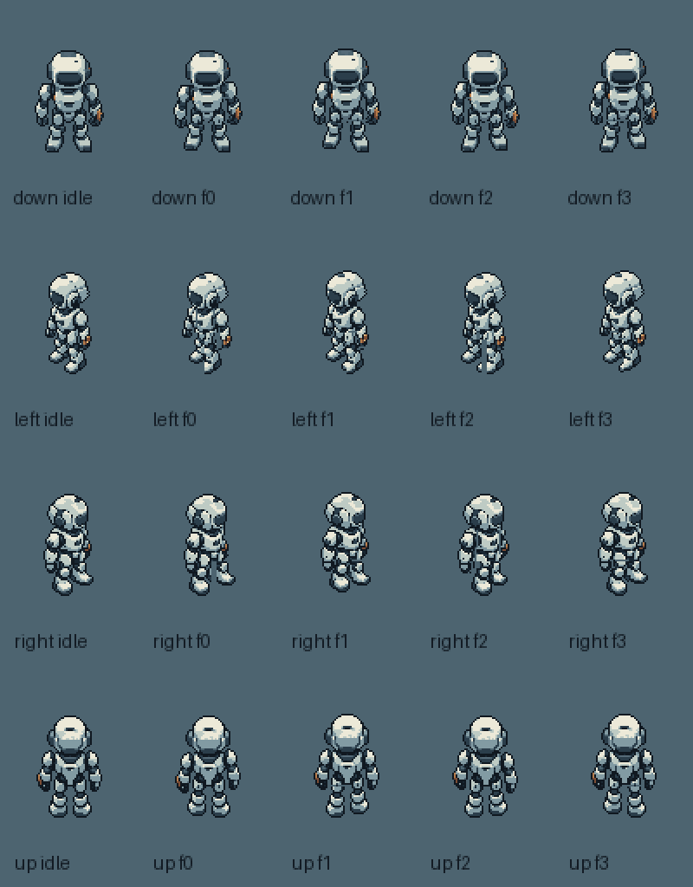

# 《余烬采能站》机器人四向动画交付

**历史v001批次记录。** 后续逐帧复查确认了3处游离像素与5处关节断缝，本页原验收未识别这些问题。现已交付[机器人v002修复版](asset-production-robot-repair-v002.md)，请使用[robot_sprite_frames_v002.tres](../../assets/ember/characters/robot/robot_sprite_frames_v002.tres)及[修正版示例](../../scenes/ember/robot_animation_sandbox_v002.tscn)。以下v001路径和计数均保留为当时快照，不作为当前推荐入口；最新全套为[v005 ZIP](../../art-source/ember/deliveries/ember_assets_v005_2026-10-04.zip)。

全套最新艺术进度 **123/123**，见[完整艺术交付说明](asset-production-full-art.md)。本文保存机器人批次交付时的 83/123 快照，角色 PNG 和本批来源记录保持原样。

日期：2026-10-04（Asia/Irkutsk）。C01 的 **20/20 原生帧已完成像素整理及逐帧审查**：四方向各一帧待机、四帧行走。本批新增 19 帧，原朝下待机文件保留原字节。PNG 与图集自动验收为 456 项检查、0 失败；[Godot 实际报告](../../art-source/ember/batch-02-robot/review/godot_validation_v001.json)已确认导入、SpriteFrames 保存重载与实际播放；完整循环、渲染及无原缓存复用证据见本批 review 目录。

当前全套美术为 **83/123 艺术单元，剩余 40 个**：瓦片 62＋机器人 20＋采能站 1。图集、预览和重复使用不增加艺术计数；可选 C02 采集动作、技术输入与参考图不计入这 123。生产 PNG 共 25 张：3 张瓦片 atlas、20 张角色单帧、1 张角色 atlas、1 张采能站。

[当前完整交付包 ember_assets_v002_2026-10-04.zip](../../art-source/ember/deliveries/ember_assets_v002_2026-10-04.zip)包含三套通用瓦片、机器人动画、采能站、五份 Godot 资源、两个可编辑示例，以及母稿、完整提示词、原生标注、整理脚本和验收证据。旧 v001 瓦片 ZIP 保留为 64 单元的历史交付快照。

## 文件与帧序

正式目录为 `assets/ember/characters/robot/`。单帧为 `robot_idle_<direction>_v001.png` 和 `robot_walk_<direction>_f00..03_v001.png`，均为 **64×96 RGBA**，Alpha 仅 0/255。主体最多 40×64，使用登记调色板，静态底图不烘焙青色能量、橙色预警、红色危险状态或发光。

| atlas 行 | 朝向 | 第 0 列 | 第 1～4 列 |
| --- | --- | --- | --- |
| 0 | down | idle_down | walk_down f00～f03 |
| 1 | left | idle_left | walk_left f00～f03 |
| 2 | right | idle_right | walk_right f00～f03 |
| 3 | up | idle_up | walk_up f00～f03 |

[robot_animations_v001.png](../../assets/ember/characters/robot/robot_animations_v001.png)为 320×384，5 列×4 行、零边距、零间隔。[帧目录](../../assets/ember/characters/robot/robot_frames_catalog_v001.json)登记坐标、SHA256、帧序、窗口位置与来源。每个 atlas 裁片包括透明像素 RGB 在内，与对应单帧逐像素相同。



## 在 Godot 中复用

将 [robot_sprite_frames_v001.tres](../../assets/ember/characters/robot/robot_sprite_frames_v001.tres)指定给自己的 `AnimatedSprite2D.sprite_frames`。动画有 `idle_down/left/right/up` 与 `walk_down/left/right/up` 共 8 个；walk 为 8 FPS、4 帧循环，idle 为单帧、1 FPS 的资源占位速率，不宣称制作了呼吸动画。

```gdscript
# 所有帧共用同一画布，以虚拟脚底作为角色节点原点。
var robot := AnimatedSprite2D.new()
robot.sprite_frames = preload("res://assets/ember/characters/robot/robot_sprite_frames_v001.tres")
robot.centered = false
robot.offset = Vector2(-32, -80)
robot.texture_filter = CanvasItem.TEXTURE_FILTER_NEAREST
add_child(robot)
robot.play("walk_down")
```

打开 [robot_animation_sandbox.tscn](../../scenes/ember/robot_animation_sandbox.tscn)可比较四方向待机与行走的原生、2 倍显示。该场景独立于游戏主场景，作为可编辑的素材审阅示例；移动、碰撞、导航、任务状态与 Shader 根据你的游戏另外接入。

固定虚拟脚底为 **(32,80)**，节点 offset 不随帧改变。待机可见底边为 y=80；行走抬脚与侧视近远投影允许底边为 y=78～80。近侧靴抬起时不拉长远侧腿来填齐 bbox，也不逐帧裁图或上下移动整个角色节点。头胸最多 1 个原生像素起伏，脚移动 1～2 像素，工具与左腕共同移动。

窗口记录随胸甲姿势变化；朝上背视隐藏胸窗，`runtime_windows` 为空。其余方向使用 catalog 逐帧安全矩形、中心和 UV；这些位置记录不等于精确窗口 Mask。当前只有单张合成 RGBA 帧，原生 rig 蒙版属于可编辑制作标注，未交付独立运行时组件层。发射点为空，无烘焙 emission，对象不平铺。

## 来源与修正

本批实际调用内置 `image_gen.imagegen` **19 次、成功输出 19 份母稿**，完整提示词、参考版本、原始工具路径与哈希保留于[生成记录](../../art-source/ember/batch-02-robot/generation-record.json)。母稿为 1024×1536，模型 Alpha 含半透明；没有将其直接缩小当作正式像素帧，也没有用旧游戏美术作参考。

模型的步态相位、头身比例和装甲局部并不完全一致。整理过程先建立三个新方向 idle，再将同方向已确认的原生头、躯干、双臂和双腿分配到显式像素蒙版，按逐帧母稿观察移动部件、修补关节、调整遮挡和固定工具手。四阶段为左脚接触、右脚经过、右脚接触、左脚经过；未对整个站姿做仿射变形或镜像。

来源登记为 `AI_MATERIAL_AND_POSE_REFERENCE_WITH_NATIVE_PIXEL_FINISH`，不登记为 CC0，也不宣称模型母稿的逐像素提取。每帧 `.finish.json` 绑定母稿、标注、idle、rig 和正式帧哈希；[整理器](../../art-source/ember/batch-02-robot/tools/finish_robot_frames.py)、[标注](../../art-source/ember/batch-02-robot/annotations/)与原母稿随包保留。

## 验收与复现

[生产 PNG 自动报告](../../art-source/ember/batch-02-robot/validation-production-v001.json)检查 20 帧画布、边界、调色板、状态色、二值 Alpha、固定锚点、8 组动画帧序、20 个 atlas 裁片和整姿平移诊断，456 项检查零失败。[视觉审查](../../art-source/ember/batch-02-robot/art-review-v001.json)另记录原生、2 倍、浅/深底、工具遮挡、步态及 f03→f00 端点；自动通过不替代视觉审查，也不代表用户已批准最终风格。

[完整独立验收](../../art-source/ember/batch-02-robot/validation-frames-v001.json)另由验收代理实际查看全部 20 帧、1/2 倍接触表、浅/深底与四个循环端点。19 份实际母稿、19 份原生标注、32 项 idle/rig 依赖及推广帧 SHA 全部一致；10 份 APNG/GIF 解码后的角色像素均与原生帧一致。合并 GIF 曾被自动调色误改黄铜色，现使用固定标准调色板修正，正式 PNG 未受影响。

APNG 每帧 125ms，完整周期 500ms；GIF 因 10ms 延时精度使用 120/130/120/130ms，平均 8 FPS。[四向循环预览](../../art-source/ember/batch-02-robot/pixel-review/walk_all_directions_8fps_2x.gif)只用于审阅，背景色未写入生产 PNG。

[真实 Godot 渲染](../../art-source/ember/batch-02-robot/review/godot_robot_animation_sandbox_v001.png)为 1280×800。引擎通过 `frame_changed` 观察完整播放周期：原生与 2 倍的 8 个 walk 预览均访问 0/1/2/3，并发生至少一次 3→0 回环；8 个 idle 预览保持帧 0。显示倍率不会新增动画资源。

[Godot 最终执行摘要](../../art-source/ember/batch-02-robot/review/godot-delivery-summary-v001.json)记录 4.7.2 stable 的 9 阶段实际退出码均为 0、stderr 空。独立新工程只复制 59 个交付文件，导入前无 `.godot` 缓存、无 Game/autoload；机器人重载、完整循环及渲染通过，四份 TileSet 和 62 个画笔也通过共存复用。原项目 38 个受保护文件、本批只读核验的 25 个文件及 fresh 复制的 59 个文件 SHA 未变。正式 ZIP 排除该新工程副本和缓存。

从项目根目录执行；`godot` 代表你配置好的 Godot 可执行程序：

```powershell
# 导入PNG后构建SpriteFrames与示例，默认保留你修改过的已有示例。
godot --headless --editor --path . --import
godot --headless --path . -s res://tools/build_ember_robot_animation.gd --
# 后续只核验，不重写.tres和场景。
godot --headless --path . -s res://tools/build_ember_robot_animation.gd -- --verify-only
```

原朝下待机 SHA256 保持 `c65f68455554edb03aea0a7b7b3cea6e1a779fa9d5aa49cba9b4aa5c4f6fbfff`。当前未完成的 40 单元为建筑/物件 18、UI 15、VFX 美术输入 4、3D 美术输入 3；它们未因这批机器人动画而登记完成。
