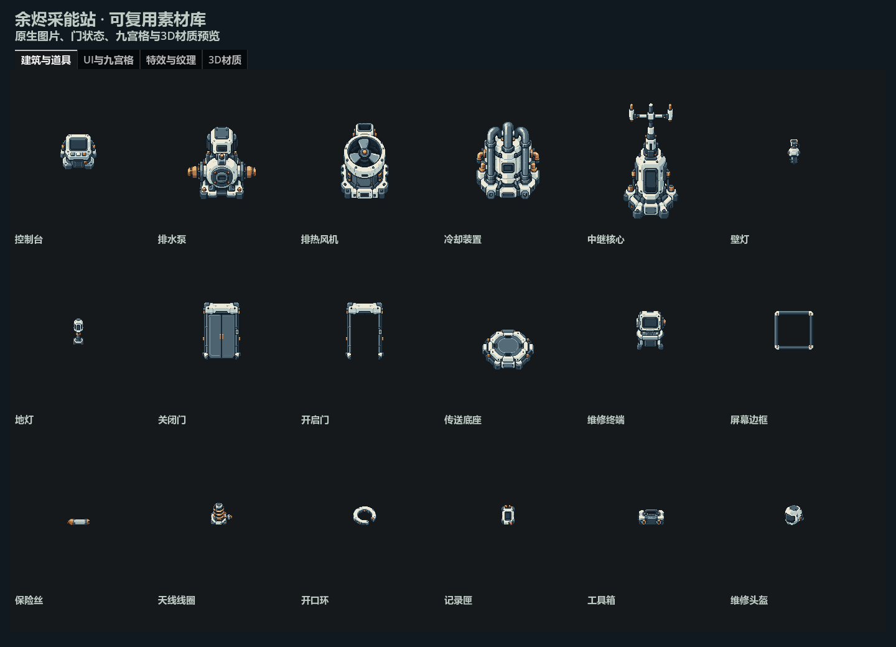
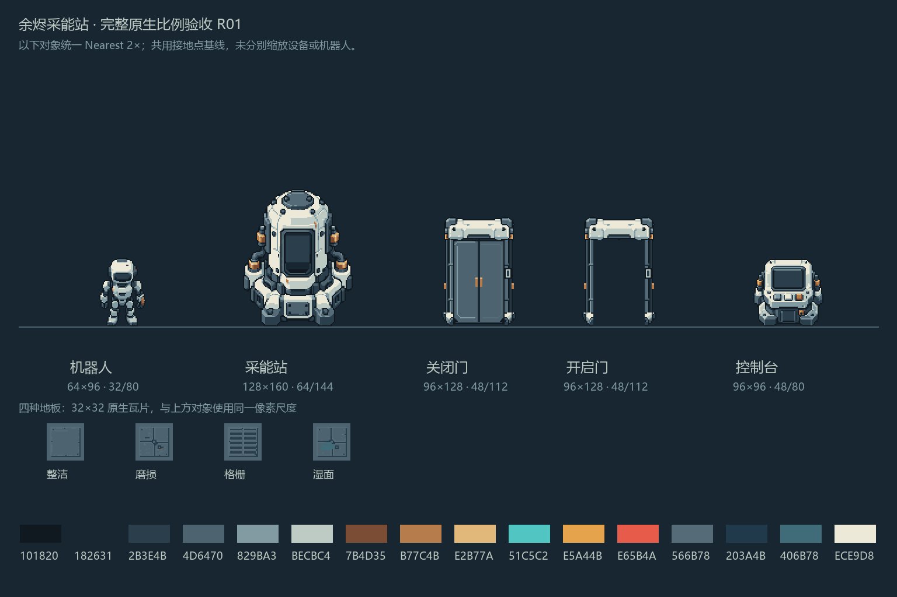

# 《余烬采能站》完整艺术素材交付

当前入口更新（2026-10-04）：机器人使用 [v002 修正版](asset-production-robot-repair-v002.md)，全套推荐包为 [v005](../../art-source/ember/deliveries/ember_assets_v005_2026-10-04.zip)。本页的数量、验证记录及文末 v003 包属于原艺术交付快照；当前课程覆盖与待补项见[素材综合审核](asset-curriculum-review-2026-10-04.md)。

2026-10-04 后续更新：D01～D12的40技术输入已完成，见[技术输入交付](asset-production-technical-inputs.md)。下方艺术验收和技术待制说明保留为艺术批次快照；D13仍取决于实际布局，课程进度不变。

日期：2026-10-04。**123/123 艺术单元已完成，剩余艺术项 0**。其中 120 项 2D、3 项 3D；按逻辑单元计数，组件层、图集打包、参考图和重复刷块不增加数量。共有 65 张正式 PNG、11 份 .tres 和 3 个独立示例场景。

| 范围 | 艺术单元 | 正式文件 |
| --- | ---: | --- |
| 三套通用瓦片 | 62 | 3 atlas、4 TileSet；[TileMapLayer 布局方法](tilemap-reusable-tilesets.md) |
| 四向机器人 | 20 | 20 单帧、1 atlas、1 SpriteFrames；[动画报告](asset-production-batch-02-robot.md) |
| 采能站与建筑道具 | 19 | 19 PNG；门两态 SpriteFrames、屏幕 StyleBoxTexture |
| HUD／任务／九宫格 UI | 15 | 14 图标、1 面板；面板 StyleBoxTexture |
| 水纹／泡沫／烟团 | 4 | 4 PNG |
| 草片／金属／混凝土 | 3 | 3 PNG、3 StandardMaterial3D |

## 直接复用

打开[瓦片布局场景](../../scenes/ember/tileset_layout_sandbox.tscn)，选择 `LayoutWorkspace` 中的 TileMapLayer 手工布置，或把[合并 TileSet](../../assets/ember/environment/tilesets/ember_common_tileset_v001.tres)指定给自己的 TileMapLayer。当前为手工刷块；接口、覆盖层和方向约束见瓦片文档。

打开[机器人 v002 场景](../../scenes/ember/robot_animation_sandbox_v002.tscn)查看四向动画；将 [SpriteFrames v002](../../assets/ember/characters/robot/robot_sprite_frames_v002.tres)指定给 AnimatedSprite2D，设置 `centered=false`、`offset=(-32,-80)`、Nearest。walk 使用 8 FPS。旧 v001 行走存在已确认的断裂，保留为历史对照，不再作为推荐入口。

打开[新素材库场景](../../scenes/ember/asset_library_sandbox.tscn)，四个页签分别展示建筑道具、UI／九宫格、特效纹理、3D 材质。此场景独立调整自己的预览窗口，不改项目主场景。PNG 不包含文字、运行灯色、烟火或课程 Shader 效果。

在自己的 Sprite2D 使用对象时，建议 `centered=false`、`offset=-anchor`，并启用 Nearest。锚点是像素边界坐标。所有新对象的画布、主体 bbox、灯窗区域、发射点、来源和可拆层见[40项生产目录](../../assets/ember/ember_additional_catalog_v001.json)。源层仍在 `art-source/ember/batch-03-objects/layers/`，与对应 PNG 共用完整画布／锚点；可动叶片、门前景和中继顶部的组合已核对。`art-source` 由 `.gdignore` 排除导入；需要运行时拆层时，将所需组件复制到自己的 `assets` 子目录，逐层绑定 Sprite2D，并使用同一 `offset=-anchor` 和目录中的 z_index。

| 可直接指定的资源 | 用法 |
| --- | --- |
| [door_states_v001.tres](../../assets/ember/buildings/door/door_states_v001.tres) | AnimatedSprite2D 的 `closed`／`open`；96×128、锚点48/112、共用精确门框 |
| [panel_style_v001.tres](../../assets/ember/ui/panels/panel_style_v001.tres) | Panel 的 `panel` StyleBox；四边8px；已实际渲染192×96、400×180、600×300 |
| [screen_style_v001.tres](../../assets/ember/buildings/terminal/screen_style_v001.tres) | 屏幕边框；原图region `(16,16,64,64)`、四边8px、中心透明；已拉伸640×96 |
| [grass_leaf_v001.tres](../../assets/ember/three_d/materials/grass_leaf_v001.tres) | QuadMesh 材质；Alpha Scissor 0.5、双面；根部32/120 |
| [metal_v001.tres](../../assets/ember/three_d/materials/metal_v001.tres) | 金属底色材质，metallic 0.55、roughness 0.65 为复用起点 |
| [concrete_v001.tres](../../assets/ember/three_d/materials/concrete_v001.tres) | 混凝土底色材质，metallic 0、roughness 1 |

九宫格原理与属性对应 Godot 的 [StyleBoxTexture](https://docs.godotengine.org/en/stable/classes/class_styleboxtexture.html)；材质属性对应 [BaseMaterial3D](https://docs.godotengine.org/en/stable/classes/class_basematerial3d.html)。3D 纹理使用 Lossless、实际 Mipmaps、Nearest with Mipmaps；近／远距离渲染分别保留在验证目录。2D PNG 使用 Lossless、无 Mipmaps、Nearest。水纹与两种材质 XY 重复，泡沫只 X 重复；烟团／草片不重复。请在使用节点或材质上按这个轴向配置重复采样。

## 新增40项逐项信息

以下 sha256 与[数值报告](../../art-source/ember/full-art-v001/validation-candidates-v001.json)、[美术审查](../../art-source/ember/full-art-v001/art-review-v001.json)绑定；完整值与源层路径见生产目录。

| ID | 名称 | 画布 | anchor | 正式PNG |
| --- | --- | --- | --- | --- |
| `console_base` | 控制台 | 96×96 | 48/80 | [console_base_v001.png](../../assets/ember/buildings/console/console_base_v001.png) |
| `pump_base` | 排水泵 | 160×192 | 80/176 | [pump_base_v001.png](../../assets/ember/buildings/pump/pump_base_v001.png) |
| `ventilator_base` | 排热风机 | 160×192 | 80/176 | [ventilator_base_v001.png](../../assets/ember/buildings/ventilator/ventilator_base_v001.png) |
| `cooler_base` | 冷却装置 | 160×192 | 80/176 | [cooler_base_v001.png](../../assets/ember/buildings/cooler/cooler_base_v001.png) |
| `relay_base` | 中继核心 | 192×256 | 96/240 | [relay_base_v001.png](../../assets/ember/buildings/relay/relay_base_v001.png) |
| `wall_lamp` | 壁灯 | 64×64 | 32/56 | [wall_lamp_v001.png](../../assets/ember/buildings/lights/wall_lamp_v001.png) |
| `floor_lamp` | 地灯 | 64×64 | 32/56 | [floor_lamp_v001.png](../../assets/ember/buildings/lights/floor_lamp_v001.png) |
| `door_closed` | 关闭门 | 96×128 | 48/112 | [door_closed_v001.png](../../assets/ember/buildings/door/door_closed_v001.png) |
| `door_open` | 开启门 | 96×128 | 48/112 | [door_open_v001.png](../../assets/ember/buildings/door/door_open_v001.png) |
| `telepad_base` | 传送底座 | 128×160 | 64/144 | [telepad_base_v001.png](../../assets/ember/buildings/telepad/telepad_base_v001.png) |
| `terminal_body` | 维修终端 | 96×96 | 48/80 | [terminal_body_v001.png](../../assets/ember/buildings/terminal/terminal_body_v001.png) |
| `screen_frame` | 屏幕边框 | 96×96 | 48/80 | [screen_frame_v001.png](../../assets/ember/buildings/terminal/screen_frame_v001.png) |
| `fuse` | 保险丝 | 64×64 | 32/56 | [fuse_v001.png](../../assets/ember/props/calibration/fuse_v001.png) |
| `antenna_coil` | 天线线圈 | 64×64 | 32/56 | [antenna_coil_v001.png](../../assets/ember/props/calibration/antenna_coil_v001.png) |
| `split_ring` | 开口环 | 64×64 | 32/56 | [split_ring_v001.png](../../assets/ember/props/calibration/split_ring_v001.png) |
| `log_cartridge` | 记录匣 | 64×64 | 32/56 | [log_cartridge_v001.png](../../assets/ember/props/story/log_cartridge_v001.png) |
| `toolbox` | 工具箱 | 64×64 | 32/56 | [toolbox_v001.png](../../assets/ember/props/story/toolbox_v001.png) |
| `helmet` | 维修头盔 | 64×64 | 32/56 | [helmet_v001.png](../../assets/ember/props/story/helmet_v001.png) |
| `hp` | 生命 | 32×32 | 16/16 | [hp_v001.png](../../assets/ember/ui/icons/hp_v001.png) |
| `energy` | 能量 | 32×32 | 16/16 | [energy_v001.png](../../assets/ember/ui/icons/energy_v001.png) |
| `time` | 时间 | 32×32 | 16/16 | [time_v001.png](../../assets/ember/ui/icons/time_v001.png) |
| `interact` | 交互 | 32×32 | 16/16 | [interact_v001.png](../../assets/ember/ui/icons/interact_v001.png) |
| `log` | 记录 | 32×32 | 16/16 | [log_v001.png](../../assets/ember/ui/icons/log_v001.png) |
| `pause` | 暂停 | 32×32 | 16/16 | [pause_v001.png](../../assets/ember/ui/icons/pause_v001.png) |
| `lighting` | 照明 | 32×32 | 16/16 | [lighting_v001.png](../../assets/ember/ui/tasks/lighting_v001.png) |
| `drainage` | 排水 | 32×32 | 16/16 | [drainage_v001.png](../../assets/ember/ui/tasks/drainage_v001.png) |
| `water_supply` | 输水 | 32×32 | 16/16 | [water_supply_v001.png](../../assets/ember/ui/tasks/water_supply_v001.png) |
| `ventilation` | 排热 | 32×32 | 16/16 | [ventilation_v001.png](../../assets/ember/ui/tasks/ventilation_v001.png) |
| `cooling` | 冷却 | 32×32 | 16/16 | [cooling_v001.png](../../assets/ember/ui/tasks/cooling_v001.png) |
| `communication` | 通信 | 32×32 | 16/16 | [communication_v001.png](../../assets/ember/ui/tasks/communication_v001.png) |
| `teleport` | 传送 | 32×32 | 16/16 | [teleport_v001.png](../../assets/ember/ui/tasks/teleport_v001.png) |
| `protection` | 保护 | 32×32 | 16/16 | [protection_v001.png](../../assets/ember/ui/tasks/protection_v001.png) |
| `panel_9slice` | 九宫格面板 | 96×96 | 48/48 | [panel_9slice_v001.png](../../assets/ember/ui/panels/panel_9slice_v001.png) |
| `water_calm` | 平静水纹 | 64×64 | 0/0 | [water_calm_v001.png](../../assets/ember/vfx/water/water_calm_v001.png) |
| `water_directional` | 定向水纹 | 64×64 | 0/0 | [water_directional_v001.png](../../assets/ember/vfx/water/water_directional_v001.png) |
| `foam_strip` | 泡沫条 | 64×64 | 0/0 | [foam_strip_v001.png](../../assets/ember/vfx/water/foam_strip_v001.png) |
| `smoke_blob` | 烟团 | 64×64 | 32/32 | [smoke_blob_v001.png](../../assets/ember/vfx/smoke/smoke_blob_v001.png) |
| `grass_leaf` | 草片 | 64×128 | 32/120 | [grass_leaf_v001.png](../../assets/ember/three_d/textures/grass/grass_leaf_v001.png) |
| `metal_albedo` | 金属底色 | 256×256 | 0/0 | [metal_albedo_v001.png](../../assets/ember/three_d/textures/metal/metal_albedo_v001.png) |
| `concrete_albedo` | 混凝土底色 | 256×256 | 0/0 | [concrete_albedo_v001.png](../../assets/ember/three_d/textures/concrete/concrete_albedo_v001.png) |

## 验收与来源

本轮新增40项各有独立的实际 imagegen 母稿。母稿包含较大画布、抗锯齿和过量细节，实际生产图经过原生网格重构、固定16色整理、二值Alpha和结构校正。设备、图标或平铺模式的原生重建均在来源语义中明确登记。母稿和透明修正图不直接当作原生验收资产，不登记为 CC0。

各批生成台账和候选目录保留当时状态与字节，接受结果另存该批 `acceptance-record-v001.json`；最终状态以本次40项生产目录和验收报告为准。提示词、标注、原生源层、脚本和依赖均被来源报告绑定SHA；验收后改动会阻止推广和封包。

- [建筑道具生成记录](../../art-source/ember/batch-03-objects/generation-record.json)、[UI生成记录](../../art-source/ember/batch-04-ui/generation-record.json)、[纹理生成记录](../../art-source/ember/batch-05-textures/generation-record.json)：实际输出路径、归档母稿、完整提示词及参考依赖。
- [独立来源复核](../../art-source/ember/full-art-v001/validation-provenance-v001.json)：40份母稿逐份对照原始工具输出，提示词与源层组合核对。
- [原生数值检查](../../art-source/ember/full-art-v001/validation-candidates-v001.json)：507条检查通过；尺寸、固定16色、二值Alpha、留白、锚点、平铺边界与当前输出SHA一致。数值通过不代替视觉检查。
- [美术检查](../../art-source/ember/full-art-v001/art-review-v001.json)：实际原生／2倍、设备与图标语义、门框和透明门洞、九宫格多尺寸、五种3×3平铺及代理交叉意见。
- [对象／UI独立交叉审查](../../art-source/ember/full-art-v001/independent-objects-ui-review-v001.json)：覆盖18对象与15UI；纹理制作方未将自己的7纹理列为独立审查，纹理由根另行实际查看。
- [Godot与新工程摘要](../../art-source/ember/full-art-v001/godot-delivery-summary-v001.json)：10个实际执行阶段，退出码0、stderr为空。全套复制到无原缓存、无旧游戏autoload的新工程，资源保存重载、62瓦片、20机器人帧、40新PNG和实际渲染通过。
- [R01统一比例板](../../art-source/ember/references/full_native_scale_v003.png)：机器人、站点、开关门、控制台和四地板统一2倍，没有按对象分别缩放。





## 验证和再生成

在项目根目录 PowerShell 运行，Godot 路径按本机安装修改：

```powershell
$godotExe = 'E:/steam/steamapps/common/Godot Engine/godot.windows.opt.tools.64.exe'
& $godotExe --headless --editor --path . --import
& $godotExe --headless --path . --script res://tools/build_ember_asset_library.gd -- --verify-only
& $godotExe --headless --path . --script res://tools/build_ember_tilesets.gd -- --verify-only
& $godotExe --headless --path . --script res://tools/build_ember_robot_animation.gd -- --verify-only
```

`--verify-only` 只检查已存在的资源与场景。新素材库构建器默认保留已有示例；只有明确传 `--rebuild-sandbox` 才重建示例场景。重新整理原生源时，先产生新版本候选、数值与视觉验收记录，避免覆盖既有版本。纹理源、工具、验证器和全部生成提示词随包保留。

## 交付包与范围

[ember_assets_v003_2026-10-04.zip](../../art-source/ember/deliveries/ember_assets_v003_2026-10-04.zip)含65正式PNG、11资源、3示例、完整母稿／原生源层／脚本／验证记录。包内 `DELIVERY-MANIFEST.json` 对每个载荷文件给出 SHA256；包外 `.package.json` 和 `.audit.json` 记录ZIP校验，不做自引用。此前 v001/v002 包保留原样。

艺术素材完成不等于整个游戏／课程完成。D01～D12的40个技术输入预算、D13布局相关0～30个Mask、可选collect8帧、实际关卡、课程Shader、3D模型／UV及音频没有在本次艺术交付中登记完成。材质常量不代替D11法线等派生图；对象灯窗与发射点不代替D08通道Mask。现有主游戏和学习者Shader仍按各自进度使用原资源，迁移另行实施。
