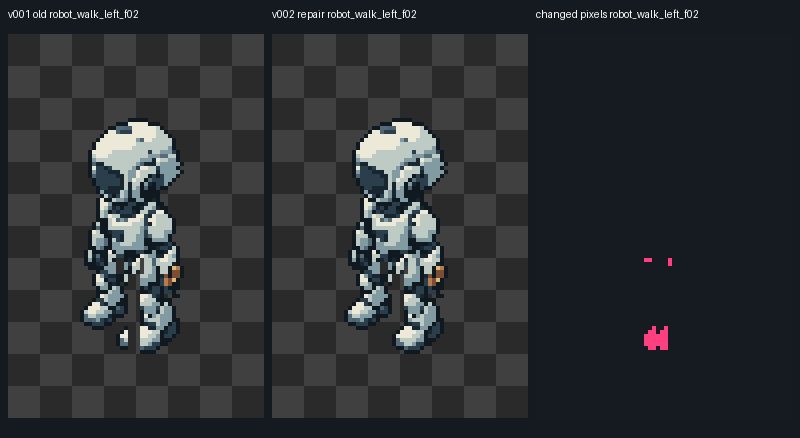

# 《余烬采能站》机器人行走断裂修复 v002

2026-10-04。本次已修复v001的3处确定断裂，并补齐5处肩部／髋部断缝。请改用[robot_sprite_frames_v002.tres](../../assets/ember/characters/robot/robot_sprite_frames_v002.tres)，或打开[robot_animation_sandbox_v002.tscn](../../scenes/ember/robot_animation_sandbox_v002.tscn)。旧v001 PNG、源标注、资源、场景、验收记录和v001～v004交付包保留作历史对照；它们不会自动获得本次修复。

本次新增16张行走PNG与1张320×384图集，复用原4张待机PNG。20个姿态ID与8个动画名保持兼容，四向walk仍是4帧、8 FPS、500ms循环，画布64×96、虚拟脚底(32,80)。10张行走帧的像素实际变化，每帧6～32像素；其他6张行走帧内容相同但统一登记v002。艺术单元仍123、技术输入仍40。本目录含历史版本，共122 PNG、17份.tres、5个示例；当前推荐版本对应105 PNG、16份资源、4个示例。

## 在Godot中使用

```gdscript
# 保持固定画布与脚底锚点，避免裁片尺寸或节点位置随行走帧跳动。
var robot := AnimatedSprite2D.new()
robot.sprite_frames = preload("res://assets/ember/characters/robot/robot_sprite_frames_v002.tres")
robot.centered = false
robot.offset = Vector2(-32, -80)
robot.texture_filter = CanvasItem.TEXTURE_FILTER_NEAREST
add_child(robot)
robot.play("walk_down") # 也可使用walk_left / walk_right / walk_up。
```

[v002帧目录](../../assets/ember/characters/robot/robot_frames_catalog_v002.json)绑定4张原待机、16张新行走、图集、源标注及SHA256。atlas依次为down/left/right/up四行，每行idle/f00/f01/f02/f03五列，零间隔。所有新PNG采用Lossless、关闭mipmap、Alpha Border、Premult Alpha、法线／粗糙度自动处理及3D自动压缩；显示使用Nearest和整数倍率。

## 修复位置与方法

| 位置 | 原问题 | 修复 |
| --- | --- | --- |
| left f02靴子 | 14像素被分配到远侧腿，腿移位后脱离近侧靴子 | 修改可编辑rig归属，整只近侧靴子随left_leg移动 |
| down f01/f03髋部 | 1／2像素随腿移位后游离 | 3个中央髋部源像素归到torso |
| down前臂／腕部 | 11个前臂／腕部像素归到胸／腿部 | 归到left_arm，保留黄铜工具原归属与颜色 |
| left f00、right f02肩部 | 纵向断缝 | 显式补齐局部关节连接，保留手臂与胸侧的负空间 |
| left f01/f03、right f03髋部 | 横向断缝 | 逐个标注连接像素，保留双腿之间的开口 |

使用既有原生像素和可编辑JSON标注重新构建，未调用新图像生成。原部件整数位移、遮挡顺序、步态相位、头部与登记调色板保持一致。left f03修复后完整靴子抬高2px，可见底边由79变78，虚拟脚底仍(32,80)；这与固定节点锚点相容。没有对全图做填洞、膨胀、平滑或删除游离块。



[源标注](../../art-source/ember/robot-repair-v002/annotations/)、[逐帧变化记录](../../art-source/ember/robot-repair-v002/repair-record-v002.json)、[逐帧与完整循环复核](../../art-source/ember/robot-repair-v002/independent-repair-review.json)均随包保存。修补由制作代理完成；独立编写的PNG／rig测量工具与主审最终视觉复核共同验收。并行审阅在使用限额处停止，最终候选的视觉复核由主审接手完成，不宣称另一代理完成了最终视觉审查。

## 验证与复现

20帧已实际查看原生／4×显示及四向f00→f01→f02→f03→f00端点。全部帧无游离像素，Alpha仅0/255，无越界或新增色板颜色；全部6个语义部件在各方向rig内连通。部分合理的腿间、工具旁开口保留，连通性检查不替代视觉判断。

Godot 4.7.2实际完成9个阶段，退出码均0、stderr均空：语法、导入、导入设置重载、构建、只读核验、真实GPU渲染、新工程导入／核验／渲染。21份输入纹理的导入可见RGB与Alpha、20个atlas裁片、SpriteFrames保存重载均一致。8个walk示例实际访问0/1/2/3并完成3→0回环，8个idle保持帧0。20帧×1／2倍的40张GPU截图与源PNG一致。

新工程导入前无.godot缓存和autoload，84个复制文件导入后字节未变；40张新工程GPU截图与原工程逐张同SHA。修复前冻结的1657份文件仅允许本次更新两份说明入口；旧素材、课程Shader与学习进度保持原样。62块瓦片与41张其他艺术素材未发现已确认的同类断裂，本次复查其204份素材／源层／资源均保持原SHA；40张技术输入亦保持原样。验收绑定见[final-acceptance.json](../../art-source/ember/robot-repair-v002/final-acceptance.json)。

从工程根目录执行，`godot`代表你配置的Godot程序：

```powershell
# 使用可编辑源复现；只写相同v002新文件，遇到已有不同内容会停止。
python art-source/ember/robot-repair-v002/tools/generate_repair.py --publish
python art-source/ember/robot-repair-v002/assemble_catalog.py
# 已交付资源可直接打开；这条命令只检查，不重写资源或场景。
godot --headless --editor --path . --import
godot --headless --path . -s res://tools/build_ember_robot_animation_v002.gd -- --verify-only
```

完整[v005交付包](../../art-source/ember/deliveries/ember_assets_v005_2026-10-04.zip)保留既有瓦片、建筑、UI、特效与技术输入，默认打开修正版机器人示例；[ZIP审计](../../art-source/ember/deliveries/ember_assets_v005_2026-10-04.audit.json)验证载荷SHA与旧版本继承。课程Shader、运行时移动与可选collect动作沿用原范围。
