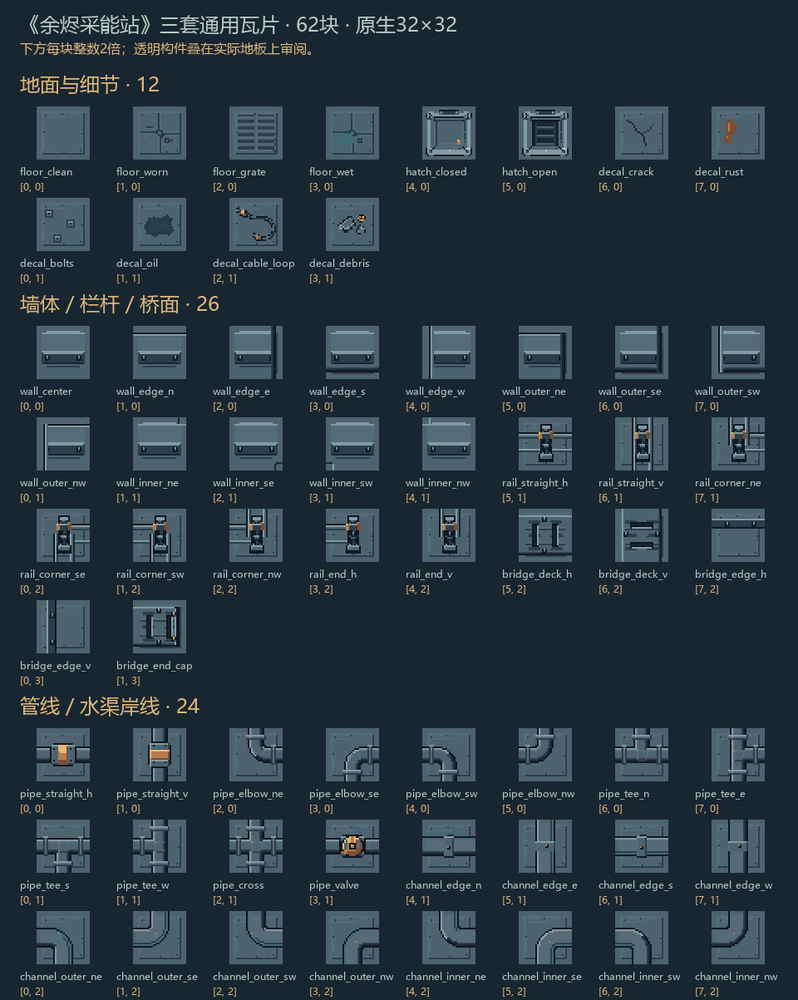
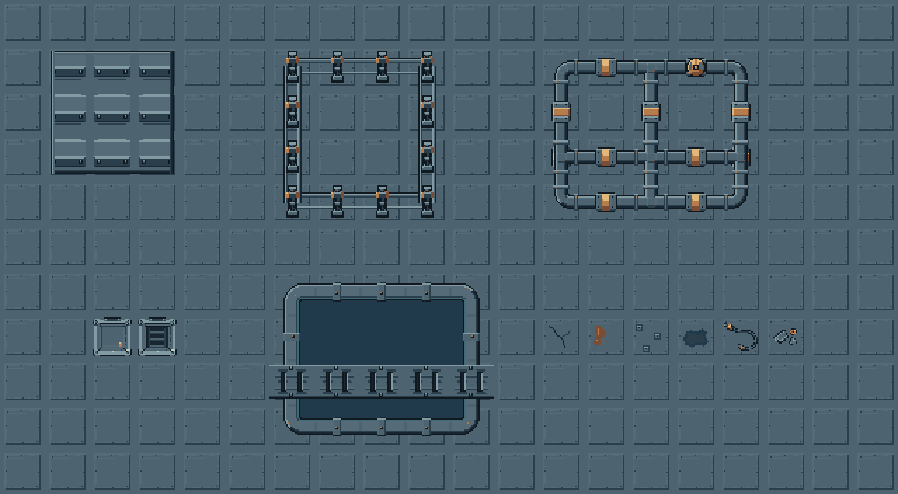
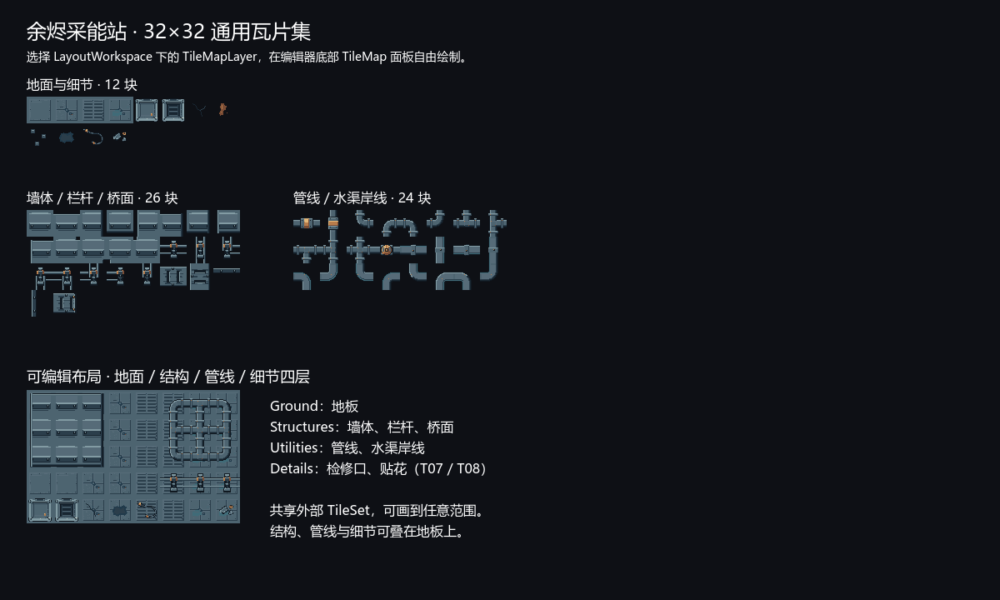
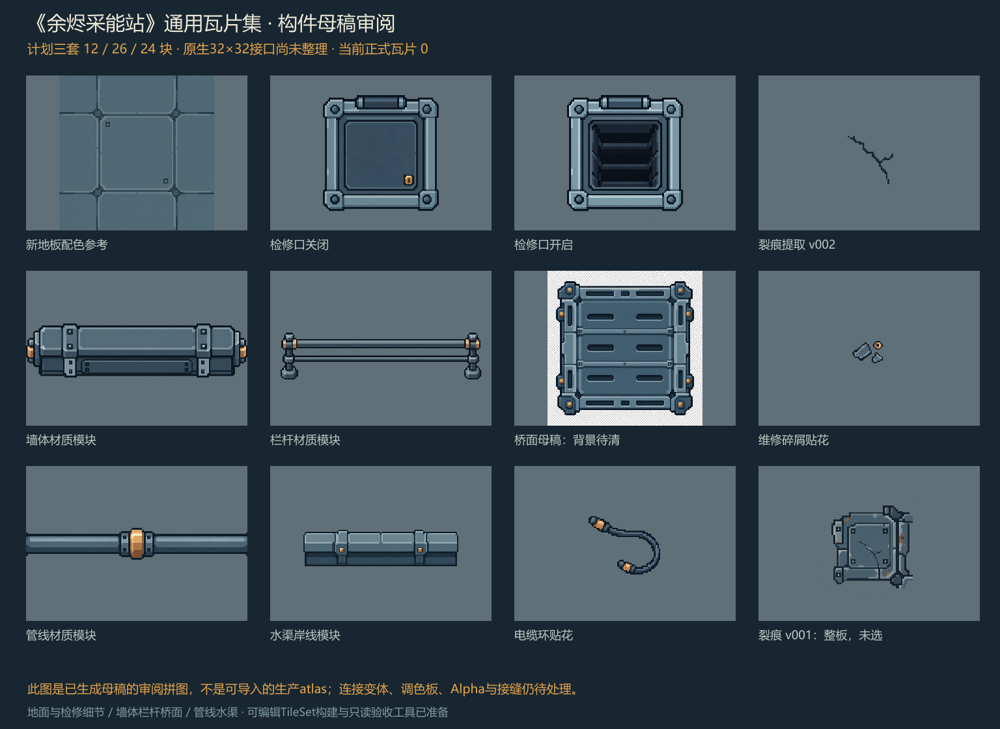

# 《余烬采能站》可复用 TileMapLayer 瓦片集交付

最新全套进度与新素材复用方法见[完整艺术交付说明](asset-production-full-art.md)。下文保留本批次范围。

更新日期：2026-10-04（Asia/Irkutsk）；制作跨 2026-10-03～2026-10-04。三套 **32×32 原生瓦片已完成像素整理、代理视觉审查并推广到正式目录**：3 张 PNG 共 62 个艺术单元，供你用 TileMapLayer 自己布置地图。Godot 4.7.2 的实际导入、资源保存重载与渲染检查已通过。

这 62 个单元采用[美术标准](art-generation-standard.md)与[生产清单](asset-generation-manifest.csv)原有 T01～T08 预算，不增加全套 123 个艺术单元。原首批四种地板已包含在本包；机器人朝下待机一帧与采能站也已完成独立原生验收，当前全套正式进度为 **123/123，剩余艺术项 0**，首批 **6/6** 完成。后续 C01 四向 **20/20 帧已完成**，见[机器人动画报告](asset-production-batch-02-robot.md)；本文瓦片范围仍为 62 单元。重复刷块、连接比较、诊断图与图集打包都不增加艺术单元数。

## 正式文件与内容

每块是原生 32×32；三张 atlas 固定 8 列、文件内零边距与零间隔。末行空槽全透明，TileSet 不为这些空槽建立画笔单元。

| 包 / source_id | 正式 PNG | 内容 | 单元 | 实际尺寸 |
| --- | --- | --- | ---: | --- |
| 地面与检修细节 / 0 | [ground_details_v001.png](../../assets/ember/environment/tilesets/ground_details_v001.png) | T01 地板 4＋T07 检修口 2＋T08 贴花 6 | 12 | 256×64 |
| 墙体、栏杆、桥面 / 1 | [structures_v001.png](../../assets/ember/environment/tilesets/structures_v001.png) | T02 墙体 13＋T03 栏杆 8＋T06 桥 5 | 26 | 256×128 |
| 管线与水渠 / 2 | [utilities_v001.png](../../assets/ember/environment/tilesets/utilities_v001.png) | T04 管线 12＋T05 水岸 12 | 24 | 256×96 |

正式坐标与接口见 [ember_tiles_catalog_v001.json](../../assets/ember/environment/tilesets/ember_tiles_catalog_v001.json)，包括 `id`、`name`、`category`、`variant`、`coord`、Alpha 与 N/E/S/W 接口。水岸另有 `layout_topology`，记录连接方向、水侧与内外角语义。

[planned-catalog-v001.json](../../art-source/ember/tilesets-v001/planned-catalog-v001.json)保留母稿阶段的坐标规划历史，不是生产目录。[62 块整理后的单块源图](../../art-source/ember/tilesets-v001/finished-tiles/)与[像素整理记录](../../art-source/ember/tilesets-v001/pixel-finish-record.json)均保留，正式 atlas 的像素与原生整理源一致。



## 自动测量与视觉审查

[原生 atlas 报告](../../art-source/ember/tilesets-v001/validation-native-atlases.json)、[地面独立报告](../../art-source/ember/tilesets-v001/validation-ground-details.json)与[独立视觉意见](../../art-source/ember/tilesets-v001/art-review-v001.json)分别保存数值、检查范围和组合限制。[只读验收脚本](../../art-source/ember/tilesets-v001/tools/validate_tileset_atlas.py)不编辑 PNG。

| 检查 | 实际结果 |
| --- | --- |
| 单元数 / 分类 / 变体 / 坐标 | 62/62；自动规则失败 0；空槽不注册 |
| 原生格 / 颜色 / Alpha | 32×32；标准调色板外颜色 0；半透明像素 0 |
| 三张 atlas 可见 RGB 色数 | 地面 12、结构 9、设施 10，均在登记 16 色内 |
| 文件一致性 | atlas SHA256 与 catalog、测量报告一致；接口语义修正前后 PNG 不变 |
| 最终接口比较 | 556 个 N/E/S/W 有向比较；声明完整，无未匹配接口；所有端口 Alpha 连续 |
| 地板 / 检修口 | 四地板全不透明，32 个 H/V 类型邻接完全相同；检修口两态 Alpha 与外框完全相同 |

接口宽度和水侧过滤后，最终比较为地板 64、墙体 136、栏杆 48、桥 10、管线 226、水岸 72，共 **556**。地板 64 包含四方向有向检查；地面专项报告中的 32 则只列 H/V 方向，两者不是新增素材计数。

初次接口规则只检查水岸宽度，得到 628 个物理匹配。审查发现其中 72 个组合水侧相反，已把岸线接口细分为 `water-N/E/S/W`，排除这些组合，原始 628 页保留为历史。当前 [review-index.json](../../art-source/ember/tilesets-v001/review/review-index.json)指向 14 页 `declared_connections_v002_*.png`。

制作代理逐项查看旧连接页 01～08 共 320 项；独立验收代理逐项查看旧 09～16 共 308 项，并复看新 13～14 的 76 项和修正示例。程序确认最终 556 是已审查 628 的子集，原生 PNG 哈希不变。代理视觉审查通过；这不宣称用户已经单独确认最终风格。

556 个端口 Alpha 均无差异。地板、栏杆、桥与管线的相同接口 RGBA 一致；32 个墙体组合有 2～3 个 RGB 像素差异，72 个水岸组合各有 6 个 RGB 像素差异。轻微方向明暗保留，轮廓连续；不能把自动通过或较小均差写成全部 RGBA 相同，也不能代替视觉检查。

四种地板已分别查看 [3×3 平铺](../../art-source/ember/tilesets-v001/review/floor_self_3x3_2x.png)与[全部类型 H/V 邻接](../../art-source/ember/tilesets-v001/review/all_floor_adjacencies_2x.png)。修正后的模块示例把水侧朝向池内，补齐 T/cross 支管；蓝色水底只是审阅底色。



## TileMapLayer 手动布置

使用共享 TileSet 可在不同 TileMapLayer 选择任一 atlas。推荐地面底层、结构层、设施层、细节层；包的分类不限制遮挡层。例如检修口、贴花、管线与栏杆应按地图阅读需要叠加。图像 Alpha 不承担碰撞、导航或任务状态判定。

本包支持手动刷块。墙体 13 片是基础连接预算，不覆盖任意 Terrain 拓扑；自动地形刷图仍需另外定义 peering bits 和完整组合。[TileMapLayer 官方说明](https://docs.godotengine.org/en/stable/classes/class_tilemaplayer.html)、[Using TileSets](https://docs.godotengine.org/en/stable/tutorials/2d/using_tilesets.html)。

水岸 `edge_n/e/s/w` 后缀表示 **水位于哪一侧**，不是“把图放在地图哪条边”。`outer` 为陆地凸出的角，`inner` 为水域凹入陆地的角；用 catalog 的 `water_sides` 和 `connected_sides` 一起判断。池内水域示例：顶边 `edge_s`、底边 `edge_n`、左边 `edge_e`、右边 `edge_w`；西北／东北／西南／东南位置分别用 `inner_se/sw/ne/nw`。

T05 不包含水面中心；水面输入另按 V01 与实际水区域制作，仍在原预算内。水流、泡沫、管内能量、危险提示与雨由 Shader 或独立输入表现。

桥面 `deck_h/v` 是宽 24 像素的主体；`edge_h` 占 `y=6..11`、与 `deck_h` 同格叠加为上边梁，`edge_v` 占 `x=6..11`、与 `deck_v` 同格叠加为左边梁。使用独立覆盖 TileMapLayer；边梁接口与主桥面不同，不作为相邻整格桥面。下／右边梁可选纵／横翻转到 `y=20..25`／`x=20..25`，但会翻转明暗，属于未审阅的可选方向。`end_cap` 是横桥右封口、W 开放；左封口或纵向端头需要可选 flip／transpose，同样不宣称所有变换已通过原生光照审查。五片保证当前原方向的手动布局。

展示采用 Nearest 和整数缩放，atlas 保持 Repeat Disabled，由地图重复刷块实现重复。`use_texture_padding` 的引擎内部扩展独立于源 PNG 的零间隔，不在 32×32 内容中添加透明缝。[CanvasItem](https://docs.godotengine.org/en/stable/classes/class_canvasitem.html)、[TileSetAtlasSource](https://docs.godotengine.org/en/stable/classes/class_tilesetatlassource.html)。

## 原生整理与来源

你在脚本像素整理方案提出后回复“继续”，随后按该方案整理母稿；图片工具的编辑方式要求已在这次继续中满足。母稿保持原样，不以旧项目美术为造型、尺寸或兼容依据。

整理脚本分别为 [地面与细节](../../art-source/ember/tilesets-v001/tools/finish_ground_details.py)、[结构](../../art-source/ember/tilesets-v001/tools/finish_structures.py)、[管线与水岸](../../art-source/ember/tilesets-v001/tools/finish_utilities.py)，再由 [assemble_tilesets.py](../../art-source/ember/tilesets-v001/tools/assemble_tilesets.py)打包。过程包括登记调色板量化、二值 Alpha、原生轮廓与明暗重建、统一端口、检修口共框及全部变体整理，超出最近邻缩小诊断的内容。

`source_use` 区分取样后整理与设计参考后原生重绘。裂痕、锈迹、螺栓、油迹及开启检修口的内态按参考语汇重绘；不称这些为母稿像素直接提取。开启态复用关闭态的共同框体。桥面只取母稿内部材料，绘制棋盘格未进入正式 PNG。

母稿来源为 `AI_GENERATED_IN_PROJECT`，正式衍生为 `AI_MATERIAL_REFERENCE_AND_NATIVE_PIXEL_FINISH`，不登记为 CC0。参考、提示词、工具、日期与调整记录随包保留。

## Godot 资源与复现

[实际 Godot 验证报告](../../art-source/ember/tilesets/godot_validation_v001.json)记录 4.7.2 stable：语法、编辑器导入、资源构建、headless 重载核验及真实渲染全部退出 0，最终 stderr 为空。三张 Texture 使用 Lossless、关闭 mipmaps；共享 TileSet 有 3 个 source、62 个坐标、`tile_id/category` 自定义数据，空槽未建立 Tile。

已生成可直接使用的四份资源：

- [共享 ember_common_tileset_v001.tres](../../assets/ember/environment/tilesets/ember_common_tileset_v001.tres)：同时提供三包画笔。
- [ground_details_tileset_v001.tres](../../assets/ember/environment/tilesets/ground_details_tileset_v001.tres)：地面与检修细节。
- [structures_tileset_v001.tres](../../assets/ember/environment/tilesets/structures_tileset_v001.tres)：墙、栏杆、桥。
- [utilities_tileset_v001.tres](../../assets/ember/environment/tilesets/utilities_tileset_v001.tres)：管线与水岸。

打开 [tileset_layout_sandbox.tscn](../../scenes/ember/tileset_layout_sandbox.tscn)，选中 `LayoutWorkspace` 下的 `Ground`、`Structures`、`Utilities` 或 `Details`，即可在编辑器底部 TileMap 面板选择图块刷图。四层共享外部 TileSet；场景另有三层目录展示，合计 7 个 TileMapLayer。也可在自己的 TileMapLayer 直接指定共享或单包 `.tres`。



1200×720 实际截图已查看，中文、62 画笔与四层可编辑布局正常。只读核验和截图前后的场景 SHA256 相同；29 个受保护旧项目／场景／Shader 文件哈希未变，新示例不替换游戏主场景。

2026-10-04 完成[生产目录再次测量](../../art-source/ember/audit-2026-10-04/validation-production-atlases.json)与[无原缓存的独立工程复用核验](../../art-source/ember/audit-2026-10-04/fresh-reuse-summary.json)：从交付 ZIP 仅提取必要资源，使用空的新工程重新导入，Godot 导入和重载均退出 0、stderr 为空，四份 TileSet、62 个画笔与布局场景通过。随后补齐对象元数据及交付说明并重新封装，12 个用于复用核验的资产／场景／目录文件哈希保持一致。

[构建器](../../tools/build_ember_tilesets.gd)可复现资源；`godot` 表示配置好的 Godot 4.7.2 可执行程序。从项目根目录运行：

```powershell
# 导入已验收的生产 PNG。
godot --headless --editor --path . --import

# 创建独立/共享 TileSet 并保存重载验证；保留已有布局示例。
godot --headless --path . -s res://tools/build_ember_tilesets.gd --

# 后续只核验资源，不覆盖你的布局。
godot --headless --path . -s res://tools/build_ember_tilesets.gd -- --verify-only
```

只有显式 `--rebuild-sandbox` 才重建布局示例。构建器不配置碰撞、Terrain 自动连接或课程 Shader；美术通过与真实 TileSet 加载通过分别记录。

已交付 [ember_reusable_tilesets_v001_2026-10-04.zip](../../art-source/ember/deliveries/ember_reusable_tilesets_v001_2026-10-04.zip)，包含三套 62 块瓦片、机器人一帧、站点、四份 TileSet、可编辑布局场景，以及原始母稿、提示词、整理脚本与测量记录。封装脚本已通过 CRC 完整性检查、生产文件数量与母稿哈希检查；本次复核修正了此前仍写成“计划文件”的说明，并同步更新 ZIP 内文档。

## 母稿阶段历史与完整提示词

母稿归档时正式瓦片 PNG 为 0、TileSet 尚未生成；下面仅保留该阶段来源与限制。当前正式成果见本文前半部分。


工具为内置 `image_gen.imagegen`。本轮成功输出 11 份，桥面第一次调用发生网络错误，随后一次重试成功，因此共 12 次调用。来源、失败记录、工具输出路径和母稿状态见[生成记录](../../art-source/ember/tilesets-v001/generation-record.json)。母稿归档时像素调整为 **无**；随后执行脚本整理，实际成果与修改记录见本文前半部分。

以下尺寸为归档母稿实测，不是生产图块尺寸。来源登记为 `AI_GENERATED_IN_PROJECT`，不登记为 CC0。所有母稿保留在 `art-source/ember/tilesets-v001/generated/`，完整提示词保留在 `prompts/`。

| 内容 | 母稿与实际尺寸 | 完整提示词 | 母稿归档时用途与限制 |
| --- | --- | --- | --- |
| 墙体 | [wall_module_master_v001.png](../../art-source/ember/tilesets-v001/generated/wall_module_master_v001.png)，1774×887 | [01 墙体提示词](../../art-source/ember/tilesets-v001/prompts/01_wall_module_master_v001.txt) | T02 材料参考；13 片墙尚未整理 |
| 栏杆 | [railing_module_master_v001.png](../../art-source/ember/tilesets-v001/generated/railing_module_master_v001.png)，1983×793 | [02 栏杆提示词](../../art-source/ember/tilesets-v001/prompts/02_railing_module_master_v001.txt) | T03 材料参考；8 片栏杆尚未整理 |
| 管线 | [pipe_module_master_v001.png](../../art-source/ember/tilesets-v001/generated/pipe_module_master_v001.png)，1983×793 | [03 管线提示词](../../art-source/ember/tilesets-v001/prompts/03_pipe_module_master_v001.txt) | T04 材料参考；12 片连接尚未整理 |
| 水渠岸线 | [channel_module_master_v001.png](../../art-source/ember/tilesets-v001/generated/channel_module_master_v001.png)，1254×1254 | [04 岸线提示词](../../art-source/ember/tilesets-v001/prompts/04_channel_bank_master_v001.txt) | T05 材料参考；12 片岸线尚未整理 |
| 桥面 | [bridge_module_master_v001.png](../../art-source/ember/tilesets-v001/generated/bridge_module_master_v001.png)，1254×1254 | [05 桥面提示词](../../art-source/ember/tilesets-v001/prompts/05_bridge_deck_master_v001.txt) | T06 材料参考；网络失败重试已恢复；母稿为 RGB 并带绘制棋盘格，需清理背景后才能整理 5 片桥 |
| 关闭检修口 | [hatch_closed_module_master_v001.png](../../art-source/ember/tilesets-v001/generated/hatch_closed_module_master_v001.png)，1254×1254 | [06 关闭检修口提示词](../../art-source/ember/tilesets-v001/prompts/06_hatch_closed_master_v001.txt) | T07 关闭态候选；安装框未逐像素校正 |
| 开启检修口 | [hatch_open_module_master_v001.png](../../art-source/ember/tilesets-v001/generated/hatch_open_module_master_v001.png)，1254×1254 | [07 开启检修口提示词](../../art-source/ember/tilesets-v001/prompts/07_hatch_open_master_v001.txt) | T07 开启态候选；未证明与关闭态固定框一致 |
| 电缆圈 | [cable_loop_module_master_v001.png](../../art-source/ember/tilesets-v001/generated/cable_loop_module_master_v001.png)，1254×1254 | [08 电缆提示词](../../art-source/ember/tilesets-v001/prompts/08_cable_loop_master_v001.txt) | T08 一种贴花候选 |
| 裂痕 v001 | [crack_module_master_v001.png](../../art-source/ember/tilesets-v001/generated/crack_module_master_v001.png)，1254×1254 | [09 裂痕初稿提示词](../../art-source/ember/tilesets-v001/prompts/09_crack_decal_master_v001.txt) | 模型生成了整块面板；未选为独立贴花，保留失败形态记录 |
| 碎屑 | [debris_module_master_v001.png](../../art-source/ember/tilesets-v001/generated/debris_module_master_v001.png)，1254×1254 | [10 碎屑提示词](../../art-source/ember/tilesets-v001/prompts/10_debris_decal_master_v001.txt) | T08 一种贴花候选 |
| 裂痕提取修正 v002 | [crack_decal_master_v002.png](../../art-source/ember/tilesets-v001/generated/crack_decal_master_v002.png)，1254×1254 | [11 裂痕提取提示词](../../art-source/ember/tilesets-v001/prompts/11_crack_extraction_master_v002.txt) | 引用裂痕 v001 进行模型编辑；人工观察确认裂痕已视觉提取，仍待 32×32 网格、16 色与 Alpha 整理 |

T08 在母稿归档阶段只有裂痕 v002、电缆圈和碎屑 **3/6 种实际候选**。锈迹、油渍、螺栓计划从已有参考派生，当时没有单独贴花 PNG。本轮已按参考语汇原生重绘锈迹、油迹与螺栓，补齐六种贴花；这三项不是额外的生图调用。裂痕 v001 与 v002 是同一种内容的版本，不增加预算。

母稿审阅图只展示参考与待修点，不是生产 atlas：



